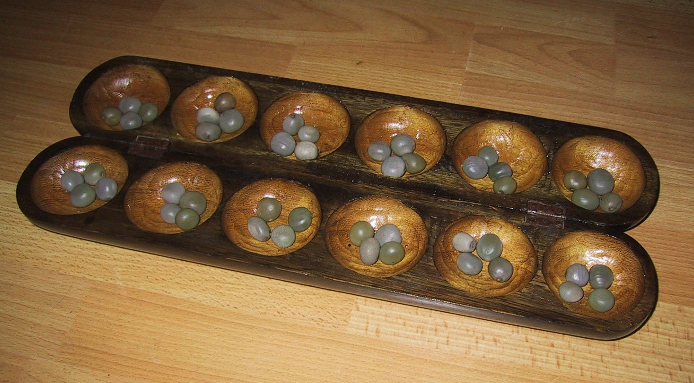

.. mancala-thesis documentation master file, created by
   sphinx-quickstart on Sat Jun  9 11:24:52 2018.
   You can adapt this file completely to your liking, but it should at least
   contain the root `toctree` directive.

Playing Mancala with MCTS and Alpha Zero
==========================================

.. toctree::
   :maxdepth: 2

   rules
   players

Mancala
-------

Mancala is a ancient family of games played played on many continents :cite:`deVoogt2008`.
The word mancala comes from the Arabic word "نقلة"transliterated "naqala"
meaning literally "to move". Mancala games usually consists of two
row of pits each containing a proportionate amount of seeds,
stones or shells. Usually, these games are played by two opponents who play sequentially.
The goal for each opponent is to capture as many seeds as possible before the other.

We will focus on Awalé (also called Oware or Owari), originating from Ghana and Kalah,
a modern version invented by William Julius Champion Jr. circa 1940.
There are too many other existing variations to list them all here,
but a few notable ones are Wari, Bao and Congkak.

   A typical Awalé board.

Perfect information games
-------------------------

Mancala games are :

* Sequential: the opponents play one after the other,
* Hold no secret information: each player has the same information about
  the game as the other
* Do not rely on randomness: the state of the game depends only on the actions
  taken sequentially by each player and an action has a deterministic result.

This type of game is called a sequential perfect information game
:cite:`osborne1994course`.

.. todo::
    Insert something about finite state machines ?

Other games in this category are for example Chess, Go, Checkers or even
Tic-tac-toe and Connect Four. This type of game is a particularly interesting
field to study in computer science and artificial intelligence as they are easy
to simulate.

While it might be tempting to enumerate every possible play of those games by
starting a game and recursively try each legal action until the end of the play,
most of the time, this is not a feasible approach for most games due to the size
of the state space. For example, Romein et al. claims that Awalé has
889,063,398,406 legal positions :cite:`romein2003solving` and the exact number
(:math:`\approx 2.08 \times 10^{170}`) of legal positions in Go has only
recently been determined :cite:`tromp2016`.

Solved games
------------

A strongly solved game is defined by Allis :cite:`Allis94searchingfor` as:

    For all legal positions, a strategy has been determined to
    obtain the game-theoretic value of the position, for both players, under
    reasonable resources.

A strongly solved game is, of course much less interesting to study than an
unsolved one as we could just make an agent that uses the strategy found when
proving the solution of the game.

Unfortunately, (:math:`m,n`)-Kalah (:math:`m` pits per side and :math:`n` stones
in each pit) has been solved in 2000 for :math:`m \leq 6`  and :math:`n \leq 6`
except (:math:`6,6`) by Jos Uiterwijk :cite:`irving2000solving` and in 2011 for
:math:`n = 6, m=6` by Anders Carstensen :cite:`kalah66`.

J. W. Romein et al. :cite:`romein2003solving` also claims to have solved
Awalé by quasi-*brute-force* -- retrograde analysis,
but this claim has since been challenged by others like Víktor Bautista i Roca.
Roca claims that several endgames were incorrect and the results are invalid.
As both the database made by Romein and the claim from Roca are not available
anymore publicly we can know who is right.

Nevertheless, these proofs for Kalah and Awalé both use a quasi-*brute-force*
method to solve the game and uses a database all possible states. The database
used by Romein et al. has 204 billion entries and weighs 178GiB. A database so
huge is of course not practical so we think that there is still room for
improvement if we can create an agent that has a policy that does not need a
exhaustive database, even if the agent is not capable of a perfect play.

We arbitrarily chose to work on Awalé as it might not have been solved but
the same work could most probably be done on Kalah.

Monte Carlo tree search
-----------------------

Many algorithms have been proposed and studied to play sequential
perfect information games.
A few examples are :math:`\alpha-\beta` pruning, Minimax,
Monte Carlo tree search (MCTS) and Alpha (Go) Zero :cite:`AlphaGoZero`.

We will focus on MCTS as it does not require any expert knowledge
about the given game to make reasonable decisions.

The principle of MCTS is simple : we represent the starting state of a game by
the root node of a tree. This node then has a children for each possible action
the current player can make. The n-th child of the node represents the state in
which the game would be if the payer had played the n-th possible action.

The maximum number of children of a node in the game is called the branching
factor. In a classical Awalé game the player can choose to sow his seeds from
one of his non-empty pits. As the player has 6 pits, the branching factor is 6
(this is very small compared to branching factor of 19 from the game of Go and
makes Awalé much easier to play with this method).

With this representation, if we build the complete tree, we will have computed
every possible state in the game and every leaf of the tree will be a final
state (end of a game). As said, previously, computing the complete tree is not
ideal for Alawé (it has :math:`\approx 8 \times 10^{11}` nodes) and
computationally impossible for games with a high branching factor.

To overcome this computational problem, the MCTS method constructs only a part
of the tree by sampling and tries to estimate the chance of winning based on
this information.

.. figure:: _static/mcts-algorithm.png

   The 4 steps of MCTS :cite:`chaslot2008monte`

The (partial) tree is constructed as follows:

* Selection: starting at the root node, recursively choose a child until
  a leaf :math:`L` is reached
* Expansion: if :math:`L` is not a terminal node\footnote{As the tree is
  not complete, a leaf could be a node that is missing its children, not
  necessarily a terminal state}, create a child :math:`C`
* Simulation: run a playout from :math:`C` until a terminal node :math:`T` is
  reached (play a full game)
* Backpropagation: update the counters described below of each ancestor
  of :math:`T`.

Each node holds 3 counters : the number of times a node has been used during a
sampling iteration (:math:`N`), the number of simulations using this node ended
with a win for the player 1 (:math:`W_1`) and player 2 (:math:`W_2`). From this
counters, a probability of winning if an action is chosen can be computed
immediately: :math:`\frac{W_1}{N}` or :math:`\frac{W_2}{N}`.

This sampling can be ran as many times as needed or allowed\footnote{Most of the
time, the agent is time constrained}, each time, refining the probability of
winning when choosing a child of the root node. When we are done sampling the
agent chooses the child with the highest probability of winning and plays the
corresponding action in the game.

Node Selection
--------------

In step 1 and 3 of the algorithm, we have to choose nodes.
There are multiples ways to choose those.

The most naïve method, in the vanilla MCTS we take a child at random each time.
This is easy to implement and has no bias but it is not effective as it explores
every part of the tree even if a part has no chance of leading to a win for the
player.

Upper Confidence Bounds for Trees
---------------------------------

A better method would be asymmetric and only explore interesting parts of the
tree. Kocsis and Szepervari :cite:`kocsis2006bandit` defined Upper Confidence
Bounds for Trees (UCT), a method mixing vanilla MCTS and Upper Confidence Bounds
(UCB).

Indeed, in step 1, selecting the node during the tree descent that maximizes the
probability of winning is analogous to the multi-armed bandit problem in which a
player has choose the slot machine that maximizes the estimated reward.

The UCB formula is the following, where :math:`N'` is the number of times the
parent of the node has been visited and :math:`c` a fixed parameter:

.. math::

    \frac{W_1}{N} + c \times \sqrt{\frac{ln N'}{N}}

:math:`c` can be tuned to balance exploitation of known wins and exploration of
less visited nodes. Kocsis et al. has shown that :math:`\frac{\sqrt{2}}{2}`
:cite:`kocsis2006bandit` is a good value when rewards are in :math:`[0, 1]`.

In step 3, the playouts are played at random as it is the first time these nodes
are seen and we do not have a generic evaluation function do direct the playout
towards "better" states.

Alpha Zero
----------

To replace the random play in step 3, D. Silver et al. propose
:cite:`AlphaGoZero` to use a neural network to estimate the value of a
game state without having to play it. This can greatly enhances the performance
of the algorithm as much less playouts are required.

Bibliography
------------

.. bibliography:: refs.bib
   :style: custom
