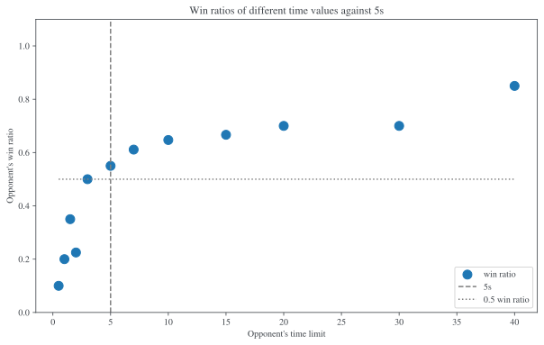

  
.. raw:: html

    <section class="first-page">
        <h1>Playing Awale with MCTS</h1>
        <h2>Master thesis submitted in partial fulfillment of the requirements
        for the degree of Master of Science in Applied Sciences and Engineering:&nbsp;Computer Science
        </h2>

        2020-2021
    </section>

  
.. contents:: Table of Contents
   :depth: 3

  
.. _sec:intro:

============
Introduction
============

Awale is a popular board game played mainly in Africa. The board has two rows of six pits, each containing four seeds in the initial state.

At each turn, the players move some seeds and can potentially capture some of them, according to deterministic rules. The goal of the game is to capture more seeds than one's opponent.

.. _board:

.. figure:: /_static/initial.jpg

   A typical Awale board in the initial state with both players on their side of the board.
   

This work explores the different machine learning approches to board games. In particular, we focus on MCTS, its evolution and variants as they proved to be good at beating humans in many games while not requiring domain specific knowlegde beyond the undertanding of the rules.
We apply those techniques to Awale because the game is not as often studied as Go or Chess, while being complex enough to be interesting. It is challenging enough to be played in real life championships but still simple enough that a single computer still has a chance to at least beat a moderate level human player.

In :numref:`sec:awale`, we present Awale in detail. We then introduce Game Theory frameworks in :numref:`sec:game-theory`.
:numref:`sec:ai-awale` reviews various approaches to solve Awale: retrograde analysis, :math:`\alpha\beta`-pruning Minimax, and basic Monte Carlo Tree Search.
In :numref:`sec:variants`, we describe more advanced versions of MCTS and in particular UCT.
:numref:`sec:method` presents the mothod used in :numref:`sec:experiments` where we show some empirical results (simulations) allowing to compare several MCTS algorithms and :numref:`sec:conclusion` concludes.

  
.. _sec:awale:

=====
Awale
=====

The subject of our study, Awale is an ancient, two player board game originating from Ghana.
This game is also sometimes called Awele, Oware, Owari or Ayo in the neighboring countries, languages and cultures :cite:`crane1982`.

Originally, the game is played on the ground, by digging two rows of six small pits, each containing
stones, seeds or shells. In the present document, we name them *seeds*. The game is also often played on a wooden board symbolizing the original dirt pits.
The board can be schematized as in :numref:`fig:initial_board`, every big circle representing a pit and every small disc representing a seed.
Numbers at the bottom right of each pit are the counts of seeds in each pit for better readability.
Each row of pits is owned by a player that sits in front of it (see :numref:`board`).
For the sake of convenience, the players are named *North* and *South*.
The 6 pits from the top row belong to North and the 6 from the bottom to South.

The players take turns, a player removing all the seeds from a pit and placing them in other pits following the rules. This is called sowing the seeds. This can result in a configuration in which the player is allowed to capture some seeds according to the rules.
The goal for each player is to capture more seeds than his opponent.
The rules vary slightly across countries and are detailed in :numref:`sec:rules`.

  

    

    
.. _fig:initial_board:
    

.. figure:: index_files/index_6_0.svg

  
  A schematized view of the initial state of the board.

  
.. _sec:mancala:

Mancala
-------

The Mancala games are an ancient family of game that are played on many continents :cite:`deVoogt2008`, Awale being one of them.
The word mancala comes from the Arabic word 'نقلة', transliterated as 'naqala' and literally meaning 'to move'.

Like Awale, Mancala games can consist of rows of pits, some of them having more than two rows (see :numref:`bao`) and sometimes extra pits with a special role. Mancala games can sometimes be played by more than two players.
 
.. _bao:

.. figure:: _static/bao.jpg

  A wooden Bao game [#source_bao]_

There are too many variants of the Mancala games to list them all here, but a
few notable ones are Awale, Wari, Bao, Congkak and Kalah.

Mancala games in general, while less known than Chess or Go, are quite popular and
are played in tournaments around the world, both in offline and online competitions :cite:`owaresociety,fandom_tournaments`.

In particular, Kalah is a commercial, modern variant of Mancala, introduced in the 1950s by William Julius Champion Jr., that is widespread in the United States. :cite:`irving2000solving`. This variant has been studied in Artifical Intelligence as early as 1964 by :cite:`russel1964`.
Nowadays, Kalah is often used as an example game in computer-science courses.
Other Mancala games have been studied in Computer Science and Artificial Intelligence :cite:`deVoogt2008`. Tournaments opposing computers on both sides have been organized multiple times, notably in the Computer Olympiad organized by the International Computer Games Association :cite:`icga_olympiad`.

  
.. _sec:rules:

Rules of the game
-----------------

The basic rules of Awale are the same everywhere but there are some minor differences around the globe and in the literature.
The rules presented here and implemented later in this thesis are inspired from :cite:`goot2001` and adapted by us.

The goal for each player is to capture more seeds than his opponent. Because the
game has 48 seeds, capturing 25 is enough for a player to win and ends the game.

Each player plays alternatively, without the right to pass his turn. A
player's turn consists in choosing one of his non-empty pits, picking all seeds
contained in the pit and sowing them one by one in every consecutive pits on the right
(rotating counter-clockwise). The player thus has at most 6 possible moves at
each turn (one per non-empty pit owned by him).

Usually, the player that starts the game is the oldest player. In this work, South always plays first.

In this work, the pits of a player are numbered left to right from his point of view as shown in :numref:`fig:pit_numbering`, :math:`1` being the leftmost pit of South, until :math:`6` at the far right. The same holds for North: :math:`1'` to :math:`6'`.

  

    

    
.. _fig:pit_numbering:
    

.. figure:: index_files/index_10_0.svg

  
  Pit numbering convention: the pits of a player are numbered left to right from his point of view.

  

As an example, in the initial state (:numref:`fig:initial_board`), the first player to move is South (on the bottom) and they play :math:`4` (highlighted in the figure in red), the board is in the state shown in :numref:`fig:first_move`.

  

    

    
.. _fig:first_move:
    

.. figure:: index_files/index_13_0.svg

  
  The board after the first move, where South played pit 4, in red.

  
When the last sowed seed is placed in a pit owned by the opponent and, after sowing,
the pit contains two or three seeds, the content of the pit is captured by
the player and removed from the game. If the pit preceding the captured pit also
contains two or three seeds, it is also captured. The capture continues until a
pit without two or three seeds is encountered. When the capture is ended the
next player's turn starts.

Otherwise, when the last sowed seed is placed in a pit that, after sowing, contains one seed, more
than 3 seeds or in the current player's own pits, the turn of the player is ended without
any capture.
For example, if South plays :math:`4` in the configuration shown in :numref:`fig:pre_capture`, they are able to capture the seeds in pits :math:`2'` and :math:`3'` (highlighted in red in :numref:`fig:post_capture`).

  

    

    
.. _fig:pre_capture:
    

.. figure:: index_files/index_16_0.svg

  
  An example of a board configuration where South is to play pit 4, in red.

  

    

    
.. _fig:post_capture:
    

  
  The resulting board after South played 4 in :numref:`fig:pre_capture`. Pits 2' and 3' in red will be captured.

  
If the pit chosen by the player contains more than 12 seeds, the sowing makes
more than a full revolution of the board and the starting hole is skipped during the second
and subsequent passes.

If the current player's opponent has no seed left in his half board, the
current player has to play a move that gives him seeds if such a move exists.
This rule is called the 'feed your opponent'.
In :numref:`fig:feed`, South has to play pit 5 because playing pit 1 would leave the opponent without any move to play.

  

    

    
.. _fig:feed:
    

.. figure:: index_files/index_21_0.svg

  
  South is forced to play pit 5, in red, because playing pit 1 would leave North without any seed to play.

  
When a player has captured more than 25 seeds the game ends and they win. If both
players have captured 24 seeds, the game ends by a draw. If the current player's
pits are all empty, the game ends and the player with the most captures wins.

The last way to stop the game is when a position is encountered twice in the
same game (there is a cycle): the game ends and the player with most captures
wins.

  
.. _sec:implem:

Implementation of the rules
---------------------------

You might be reading this document in the form of a web page or a pdf file but its original form is a Jupyter Notebook :cite:`jupyter`. Jupyter Notebooks are documents mixing computer code (in this case Python code), the result of the execution of the code and text. These can be used to document experiments in the same place they are run.

This document can be read both with and without looking at the Python code. If you are not fluent in Python or do not want to be distracted by the details of the implementation, you choose to hide the notebooks cells with the following toggle.

.. raw:: html

  <label class="switcher">
    

      <input type="checkbox" checked data-action="input->notebook-toggle#toggle">
      
    

    Show notebook code and execution results
  </label>

Sections containing code are prefixed by :code:`In[]:` and the output of the code is showed immediately under it, prefixed by :code:`Out[]:`. An example is shown below if you chose to display the notebook cells.

  

  .. code:: ipython3

    # This is Python code
    print("This was executed by Python")

.. parsed-literal::

    This was executed by Python

  
In this subsection, we use the use Jupyter Notebooks cells to define in multiple steps a Python class holding the state of the game. We then successively inherit from it to add an implementation of the rules and some convenience methods.

We set the following encoding conventions in our Python implementation:
 - :math:`0` is South, :math:`1` is North,
 - player's actions are numbered from :math:`0` being the leftmost pit in front of him to :math:`5` being the rightmost.

First, we define a dataclass with the minimal attributes needed to store a state of the game.

  

  .. code:: ipython3

    from dataclasses import dataclass, field
    
    @dataclass
    class Game:
        # a 2x6 matrix containing the number of seeds in each pits
        pits: np.array = field(default_factory=lambda: np.ones(6 * 2, dtype=int) * 4)
        # 0 for South and 1 for North
        current_player: int = 0
        # the number of seeds captured by each player
        captures: np.array = field(default_factory=lambda: np.zeros(2, dtype=int))

  
We then add some convenience methods that will be useful later.

  

  .. code:: ipython3

    class Game(Game):
        ...
    
        @property
        def view_from_current_player(self) -> List[int]:
            """Returns the board as seen by a player"""
            if self.current_player == 0:
                return self.pits
            else:
                return np.roll(self.pits, 6)
    
        @property
        def current_player_pits(self) -> List[int]:
            """Returns a 6-vector containing the pits owned by the current player"""
            if self.current_player == 0:
                return self.pits[:6]
            else:
                return self.pits[6:]
    
        @property
        def current_opponent(self) -> int:
            return (self.current_player + 1) % 2
    
        @property
        def adverse_pits_idx(self) -> List[int]:
            """Returns the indices in the `self.pits` array owned by the opposing player"""
            if self.current_player == 1:
                return list(range(6))
            else:
                return list(range(6, 6 * 2))

  
After defining a class holding the state of the game, we implement the rules,
some of them being deliberately excluded from this implementation:

-  loops in the game state are not checked (this considerably speeds up the computations and we did not encounter a loop in our preliminary work);
-  the 'feed your opponent' rule is removed; This makes the
   rules simpler and we expect it does not tremendously change the complexity of the game.

.. todo We did later encounter loops after running way more simulations. But this only happened yet using basic algorithms (greedy vs greedy for example). For now, we simulate 500 turns, if we hit this threshold, we declare a tie. This should be detailed in the experimental setup

  

  .. code:: ipython3

    class Game(Game):
        ...
    
        @property
        def legal_actions(self) -> List[int]:
            """Returns a list of indices for each legal action for the current player"""
            our_pits = self.current_player_pits
            # Return every pit of the player that contains some seeds
            return [x for x in range(6) if our_pits[x] != 0]
    
        @property
        def game_finished(self) -> bool:
            # Does the current player has an available move ?
            no_moves_left = np.sum(self.current_player_pits) == 0
    
            # Has one player captured more than half the total seeds ?
            HALF_SEEDS = 24  # (there are 2*6*4=48 seeds in total)
            enough_captures = self.captures[0] > HALF_SEEDS or self.captures[1] > HALF_SEEDS
    
            # Is it a draw ? Does both player have 24 seeds ?
            draw = self.captures[0] == HALF_SEEDS and self.captures[1] == HALF_SEEDS
    
            # If one of the above three are True, the game is finished
            return no_moves_left or enough_captures or draw
    
        @property
        def winner(self) -> Optional[int]:
            """Returns the winner of the game or None if the game is not finished or in a draw"""
            if not self.game_finished:
                return None
            # The game is finished but both player have the same number of seeds: it's a draw
            elif self.captures[0] == self.captures[1]:
                return None
            # Else, there is a winner: the player with the most seeds
            else:
                return 0 if self.captures[0] > self.captures[1] else 1

  
We can now define the :code:`Game.step(i)` method that is called for every step of the game.
It takes a single parameter, :code:`i`, and plays the i-th pit in the current sate.
This method returns the new state, the number of seeds captured and a boolean informing whether the game is finished.

  

  .. code:: ipython3

    class Game(Game):
        ...
    
        def step(self, action: int) -> Tuple[Game, int, bool]:
            """Plays the action given as parameter and returns:
                - a the new state as a new Game object,
                - the number of captured stones in the transition
                - a bool indicating if the new state is the end of the game
            """
            assert 0 <= action < 6, "Illegal action"
    
            # Translate the action index to a pit index
            target_pit = action if self.current_player == 0 else action - 6
    
            seeds = self.pits[target_pit]
            assert seeds != 0, "Illegal action: pit % is empty" % target_pit
    
            # Copy the attributes of `Game` so that the original
            # stays immutable
            pits = np.copy(self.pits)
            captures = np.copy(self.captures)
    
            # Empty the pit targeted by the player
            pits[target_pit] = 0
    
            # Fill the next pits while there are still seeds
            pit_to_sow = target_pit
            while seeds > 0:
                pit_to_sow = (pit_to_sow + 1) % (6 * 2)
                # Do not fill the target pit ever
                if pit_to_sow != target_pit:
                    pits[pit_to_sow] += 1
                    seeds -= 1
    
            # Count the captures of the play
            round_captures = 0
    
            # If the last seed was in a adverse pit we can try to collect seeds
            if pit_to_sow in self.adverse_pits_idx:
                # If the pit contains 2 or 3 seeds, we capture them
                while pits[pit_to_sow] in (2, 3):
                    captures[self.current_player] += pits[pit_to_sow]
                    round_captures += pits[pit_to_sow]
                    pits[pit_to_sow] = 0
    
                    # Select backwards the next pit to check
                    pit_to_sow = (pit_to_sow - 1) % 12
    
            # Change the current player
            current_player = (self.current_player + 1) % 2
    
            # Create the new `Game` instance
            new_game = type(self)(pits, current_player, captures)
    
            return new_game, round_captures, new_game.game_finished

  
As the game rules are now implemented, we can add some methods to display the current state of the board to the user, either in textual mode or as an SVG file that can be displayed inline in this document.

  

  .. code:: ipython3

    class Game(Game):
        ...
    
        def show_state(self):
            """Print a textual representation of the game to the standard output"""
            if self.game_finished:
                print("Game finished")
            print(
                "Current player: {} - Score: {}/{}\n{}".format(
                    self.current_player,
                    self.captures[self.current_player],
                    self.captures[(self.current_player + 1) % 2],
                    "-" * 6 * 3,
                )
            )
    
            pits = []
            for seeds in self.view_from_current_player:
                pits.append("{:3}".format(seeds))
    
            print("".join(reversed(pits[6:])))
            print("".join(pits[:6]))
    
        def _repr_svg_(self):
            """Return a SVG file representing the current state to be displayed in a notebook"""
            board = np.array([list(reversed(self.pits[6:])), self.pits[:6]])
            return board_to_svg(board, True) 

  
To show a minimal example of the implementation, we can now play a move and have its results displayed here.

  

  .. code:: ipython3

    g = Game()  # Create a new game
    g, captures, done = g.step(4)  # play the 5th pit (our implementation starts at 0)
    g  # Display the resulting board inline

    
.. _fig:svg:
    

.. figure:: index_files/index_38_0.svg

  
  An example of the SVG representation of a game state

  
.. _sec:game-theory:

=====================
Awale and Game Theory
=====================

  
In this section, we introduce the game-theoretic notions that are needed to understand the algorithms of :numref:`sec:ai-awale`. After introducing each notion, we apply it to Awale.
The notation and most conventions used for game-theoretic concepts are taken from :cite:`MaschlerSolanZamir2013`.

Basic game theoretic concepts
-----------------------------

The two main representations of games are the strategic form and the extensive form. Since the extensive-form representation is particularly  convenient for describing algorithms playing Awale, we  only present the extensive form. We also restrict this section to zero-sum  two-players finite games.
A  *zero-sum two-players finite game in extensive form*  is an ordered vector

.. math::
  \Gamma = (N, V, E, x^{0}, (V_{i})_{i \in N}, O, u),

where:

 * :math:`N= \{0,1\}` is the  set of  players,
 * :math:`x^{0}` is the initial state of the game,
 * :math:`(V , E, x_{0})` is a  finite tree with root :math:`x^{0}` called the game tree,
 * :math:`(V_{0}, V_{1})` is a partition of the set of nodes that are not leaves,
 * :math:`O \subseteq \mathbb{R}` is the set of possible game outcomes,
 * :math:`u` is a function associating every leaf of the tree with a game outcome in the set :math:`O`.

An outcome is a description of what happens when the game terminates. For zero-sum games, it is a real number corresponding to the gain of player 0 or, equivalently, the loss of player 1.

The set :math:`V_{i}` contains all nodes at which player :math:`i` is to play. In *sequential games*, players take turns.  This implies that a node at depth :math:`i` belongs to :math:`V_{0}` iff :math:`i` is even.

.. proof:application::

  Awale is a sequential zero-sum game where the  players 0 and 1 are respectively called South and North and :math:`O=\{+1,-1,0\}`, respectively  meaning South wins, North wins or draw. Each node represents a state of the game and belongs either to :math:`V_{0}` or :math:`V_{1}`. In the first case, South is to play whereas, in the second one, North is to play. Each node has between 0 and 6 children corresponding to the possible states resulting from the move of the player 'owning' that node.

  For instance, the root :math:`x^{0}` of the game tree (the initial state) belongs to :math:`V_{0}`, meaning South is to play in the initial state (see :numref:`fig:initial_board`).  The root :math:`x^{0}` has six children corresponding to the six possible states resulting from  South's move. Each of these children belongs to :math:`V_{1}`, meaning North is to play in these six states. Each of these six states at depth 1  in turn has six children corresponding to the six possible states resulting from North's move. We thus have 36 states at depth 2 and they all belong to :math:`V_{0}`, and so on.

A *perfect information* game is such that that every player who is to take an action knows the current state of the game, meaning that they know all the actions in the game that led to the current point in the play. This is not the case if, for instance, the players have cards and hide them as in poker.

.. proof:application::

  It is easy to see that Awale is a perfect information game.

Let us define a mapping :math:`A` associating to each node `x` of a game tree the set :math:`A(x)` of its children.  A *strategy* for player :math:`i` is a function :math:`s_{i}` mapping each node :math:`x \in V_{i}` to an element in :math:`A(x)`. In other words, a strategy for player :math:`i` tells us what player :math:`i` is going to play at each node of the tree where they are to play. The set of all possible strategies for player :math:`i` is denoted by :math:`S_{i}`.
A *strategy vector* is a pair of strategies :math:`s = (s_{0}, s_{1} )`, one for each player. Notice that a strategy vector completely specifies a path in the game tree down to a leaf. A strategy vector :math:`s` therefore identifies a single outcome and :math:`u(s)` can be used to denote that outcome.

.. proof:application::

  In the case of Awale, for any :math:`x`, :math:`A(x)` contains at most six nodes.

When the only outcomes of a two-player game are 'player 0 wins', 'player 1 wins' and 'draw', 
it is convenient to code these outcomes by :math:`+1, -1` and :math:`0` respectively, as we did higher for Awale.
A *winning strategy for player 0*  is then defined as a strategy :math:`(s_{0},s_{1})`
such that :math:`u(s_{0},s_{1}) = 1`  for all :math:`s_{1} \in S_{1}`. A strategy :math:`s_{0}` of
player 0 is called a strategy guaranteeing at least a draw if
:math:`u(s_{0}, s_{1}) \in \{0, 1\}`, for all :math:`s_{1} \in S_{1}`.
Similar definitions hold  for player 1.
We can now state an important result due to the founder of game theory.

.. _theo:vonNeumann:

.. proof:theorem:: :cite:`vonNeumann1928`

   In every two-player extensive form game with perfect information in which the set of outcomes is  :math:`\{-1, 0, +1\}`, one and only one of the following three alternatives holds:

   1. Player 0 has a winning strategy.
   2. Player 1 has a winning strategy.
   3. Each of the two players has a strategy guaranteeing at least a draw.

.. proof:application::

  This theorem obviously applies to Awale but the game tree of Awale is so large that it is very difficult to know which of the three statements is correct. This question has been solved only in 2003 (see :numref:`sec:retrograde`).

If player 0 chooses strategy :math:`s_{0}`, they get :math:`u(s_{0},s_{1})`, depending on the strategy :math:`s_{1}` chosen by player 1. In the worst case, player 0 gets :math:`\min_{s_{1} \in S_{1}} u(s_{0},s_{1})`. If player 0 wants to play safe, they better choose a strategy maximizing :math:`\min_{s_{1} \in S_{1}} u(s_{0},s_{1})`.
Hence the *security level  of a game for player 0* is defined by

.. math::

  \underline{v} = \max_{s_{0} \in S_{0}} \min_{s_{1} \in S_{1}} u(s_{0},s_{1}).

It is also called the *maximin value* of the game.
This is the payoff player 0 can  guarantee for himself, whatever the other player does.
A strategy :math:`s^{*}_{0} \in S_{0}` is a *maximin strategy*  if :math:`u(s^{*}_{0},s_{1}) \geq
\underline{v}_{0}` for all :math:`s_{1} \in S_{1}`. A maximin strategy needs not be unique.

We can also define the *minimax value* of a game as

.. math::
  \overline{v} = \min_{s_{1} \in S_{1}} \max_{s_{0} \in S_{0}} u(s_{0},s_{1}).

Player 1 can guarantee that they will pay no more than :math:`\overline{v}`.  A strategy of Player 1 that guarantees :math:`\overline{v}` is called a minimax strategy. The maximin strategy of player 0 and the minimax strategy of player 1 are called *optimal strategies*.
Since we consider zero-sum games, a payment made by player 1 is a gain for player 0 and player 0 is guaranteed to receive no more than :math:`\overline{v}` (if player 1 plays his minimax strategy). Hence, if  players 0 and 1 respectively play their maximin and minimax strategies, the gain of player 0 is at least :math:`\underline{v}` and at most :math:`\overline{v}`. It follows that :math:`\underline{v} \leq \overline{v}`.

If :math:`\underline{v} = \overline{v}`, then we say *the game has a value* and :math:`\underline{v}=\overline{v}` is called the *value of the game*,  simply denoted by :math:`v`. The value of the game represents the gain of player 0 (or the loss of player 1). Any of the  maximin and minimax strategies of players 0 and 1 respectively are then called *optimal strategies*.
Calculating the value of a game (when it exists), is called *solving the game*. it can be done by computing the maximin value or the minimax value (because they are equal).

Consider  a finite two-players zero-sum game with perfect information with :math:`O=\{-1, 0, +1\}`  and let us apply :numref:`theo:vonNeumann`.  There are three cases.

 1. If player 0 has a winning strategy, then :math:`\underline{v}=1` and by the zero-sum property, :math:`\underline{v}=1`. Whence the game has a value and it is 1.
 2. If player 1 has a winning strategy, then :math:`\underline{v}=-1` and by the zero-sum property, :math:`\underline{v}=-1`. Whence the game has a value and it is -1.
 3. If each of the two players has a strategy guaranteeing at least a draw, then each of them  plays such a strategy and the outcome of the game is a draw. So, :math:`\underline{v}=0` and  :math:`\underline{v}=0`. Whence anew the game has a value and it is 0.

We have just proved the following:

.. _theo:value:

.. proof:theorem::

  Every finite two-player zero-sum extensive-form game with perfect information and with :math:`O=\{-1, 0, +1\}` has a value.

This is a special case of Theorem 4.43 in :cite:`MaschlerSolanZamir2013`.

.. proof:application::

  Awale has a value :math:`v` and it belongs to :math:`\{-1, 0, +1\}`. It is therefore possible  to solve Awale (see :numref:`sec:retrograde`).
  When both players play their optimal strategy, South wins :math:`v` and North pays :math:`v`. If a player has a winning strategy, then it is also an optimal strategy. Any maximin strategy is an optimal policy.

Let us consider a game :math:`\Gamma` with game tree :math:`(V,E,x^{0})`.
Given a node :math:`x \in V`, we may consider the subtree with root :math:`x`, which is  obtained by removing all nodes of :math:`V` that are not descendants of :math:`x`. The partition :math:`(V_{0},V_{1})` of the original game :math:`\Gamma` naturally defines a partition of the nodes of the subtree. Similarly, the function :math:`u` of the original game naturally associates every leaf of the subtree to a game outcome. Therefore,
the subtree of the game tree, which we will denote by :math:`\Gamma(x)`, corresponds to a game that is called the subgame beginning at :math:`x`.

.. proof:application::

  Every subgame of Awale is a finite two-player zero-sum extensive-form game with perfect information and we can therefore appeal to :numref:`theo:value`. So, for every node :math:`x \in V`, the subgame :math:`\Gamma(x)` has a value, which is equal to the maximin value and the minimax value. It is also called the value of node :math:`x`, denoted :math:`v(x)`. It represents the gain of player 0 if, starting from node :math:`x`, both players play their optimal strategy, i.e.\  maximin for player 0 and minimax for player 1.

  Example. Suppose North has two seeds in pit  6' while South has one seed in pit 2 and one in 4 (see :numref:`fig:game`).
  Suppose also both South and North have  captured 22 seeds. Suppose finally  South is to play. If South plays 2, then North plays 6' and has no more seeds in his half board. The game ends with a draw because no player has captured more seeds than the other. If, on the contrary, South plays 4, then North plays 6', captures two seeds in pit 2 and has no more seeds in his half board.  The game ends with a win for North because they have captured more seeds than South. This subgame tree is represented in :numref:`fig:tree`. The optimal strategy for South is obviously to play 2 whereas the optimal strategy for North is the only available strategy, that is playing 6'. If both players apply their optimal strategy, the outcome is a draw and the value of the game is 0.

  

    
.. _fig:game:
    

    

  
  An nearly final position of Awale

  

    

    
.. _fig:tree:
    

.. figure:: index_files/index_44_0.svg

  
  The subgame tree corresponding to the position depicted in :numref:`fig:game`.

The minimax tree of a game with game tree :math:`(V,E,x^{0})` is the 4-tuple :math:`(V,E,x^{0},m)` where :math:`m:V\to \mathbb{R}` associates to each node its minimax value.

.. proof:application::

  By :numref:`theo:value`, the minimax value of an Awale subgame is equal to the value of the subgame. The minimax tree can thus be used to find the optimal strategies.

  
.. _sec:implem-tree:

Implementation of the tree representation
-----------------------------------------

We just saw that Awale can be represented as a tree where each node represents a state of the game and edges represent actions of the players. As many alorithms use this tree representation, we implement it in Python by inheriting from the :code:`Game()` class previously defined so that a state can hold references to its parent and children.

  

  .. code:: ipython3

    from __future__ import annotations
    from typing import Optional, List
    from weakref import ref, ReferenceType
    
    
    @dataclass
    class TreeGame(Game):
        # Hold an optional reference to the parent state
        parent: Optional[ReferenceType[Game]] = None
        # Hold a list of 6 optional references to the children
        children: List[Optional[Game]] = field(default_factory=lambda: [None] * 6)
        depth: int = 0

  
Next, we overload the ``Game.step(i)`` method so that we do not compute twice state if it was already in the tree. If a new node was generated, we keep a reference to the parent when we create a new child.

  

  .. code:: ipython3

    class TreeGame(TreeGame):
        ...
    
        def step(self, action):
            # If we already did compute the children node, just return it
            if self.children[action] is not None:
                new_game = self.children[action]
                captures = (
                    new_game.captures[self.current_player]
                    - self.captures[self.current_player]
                )
                return new_game, captures, new_game.game_finished
            # If not, call the original `step()` method and keep references in both directions
            else:
                new_game, captures, finished = super().step(action)
                new_game.parent = ref(self)
                new_game.depth = self.depth + 1
                self.children[action] = new_game
                return new_game, captures, finished

  

  .. code:: ipython3

    class TreeGame(TreeGame):
        ...
    
        @property
        def successors(self):
            children = [x for x in self.children if x is not None]
            successors = children + list(itertools.chain(*[x.successors for x in children]))
            return successors
    
        @property
        def unvisited_actions(self):
            return [i for i, x in enumerate(self.children) if x is None]
    
        @property
        def legal_unvisited_actions(self):
            return list(set(self.unvisited_actions).intersection(set(self.legal_actions)))
    
        @property
        def expanded_children(self):
            return [x for x in self.children if x is not None]
    
        @property
        def is_fully_expanded(self):
            legal_actions = set(self.legal_actions)
            unvisited_actions = set(self.unvisited_actions)
            return len(legal_actions.intersection(unvisited_actions)) == 0
    
        @property
        def is_leaf_game(self):
            return self.children == [None] * 6

  
.. _sec:ai-awale:

================================================
Artificial Intelligence approaches to play Awale
================================================

Many algorithms have been proposed and studied to play zero-sum sequential perfect information games.
We start by describing simple algorithms to be used as a baseline (random and greedy) and then continue with algorithms computing the exact minimax tree, either starting from the root (:math:`\alpha\beta` pruning Minimax) or the leaves (retrograde analysis). As those are often impractical for big game trees, we present their depth-limited variants (depth-limited minimax and end-game databases). We then explore approaches that overcome the limitation of the previous algorithms by iteratively estimating the value of promising sub-trees of the game such as Monte Carlo tree search (MCTS) and the most recent approach from Deepmind: Alpha Zero :cite:`AlphaZero`.

We quickly present and implement the above-mentioned algorithms and then focus on MCTS and its variants as they are computationally feasible and do not require expert knowledge about the given game to make reasonable decisions.

  
Before presenting those, we describe a :code:`Player` class that every implementation then reuses.
The :code:`Player` class keeps track of the game state internally.
At each turn of the game, the :code:`Player` is called with the method :code:`play()` to inform it of the action played by their opponent
(and thus update their internal state) and then chooses an action with :code:`get_action()`,
updates once more their internal state and then outputs their action for the opposing :code:`Player` to use.

  

  .. code:: ipython3

    class Player:
        def play(self, their_action):
            # If we are the first player, there is no previous action
            if their_action != -1:
                # Play the opponent's move
                self.root, _, _ = self.root.step(their_action)
            else:
                assert self.player_id == 0, "Only the first player can have their_action=-1"
            
            action = self.get_action()
            self.root, _, _ = self.root.step(action)
            
            return action

  
.. _sec:naive:

Naive agents
------------

In addition to the above-listed algorithms, we also implement two most basic agents: a random and a greedy player.
While not having any interest per se due to their simplicity and low strength, these will serve us later as a baseline to compare their strength to some more advanced algorithms.

The first, the *random agent*, is the most simple we can think of and does not use any intelligence at all: it lists all the legal actions it can play and chooses one uniformly at random.

 .. raw:: html

      <pre class="pseudocode"  data-controller="pseudocode">
        	        
	        \begin{algorithm}
	        \caption{Random agent}
	        \begin{algorithmic}
	        \PROCEDURE{GetAction}{node $x$}
	           \RETURN \CALL{ChooseAtRandom}{$A(x)$}
	        \ENDPROCEDURE
	        \end{algorithmic}
	        \end{algorithm}

      </pre>

Implemented in Python as

  

  .. code:: ipython3

    class RandomPlayer(Player):
        def __init__(self, player_id):
            self.root = Game()
            self.player_id = player_id
        
        def get_action(self):
            return random.choice(self.root.legal_actions)

  
The second is :math:`\varepsilon`-*Greedy*: an agent that tries to maximize an *immediate reward* at each turn: the number of seeds captured during that turn.
The :math:`\varepsilon \in [0, 1]` parameter introduces randomness: at each turn, the agent draws a number :math:`e` in the uniform distribution :math:`\mathcal{U}(0, 1)`, if :math:`e > \varepsilon`, the agent chooses an action uniformly at random, else it maximizes the immediate reward.

 .. raw:: html

      <pre class="pseudocode"  data-controller="pseudocode">
        	        
	        \begin{algorithm}
	        \caption{$\varepsilon$-Greedy agent}
	        \begin{algorithmic}
	        \PROCEDURE{ImmediateReward}{node $x$}
	            \IF{$x$ is a final node}
	                \IF{agent wins}
	                    \RETURN $\infty$
	                \ELSE
	                    \RETURN $-\infty$
	                \ENDIF
	            \ELSE
	                \RETURN amount of stones captured by playing $x$
	            \ENDIF
	        \ENDPROCEDURE
	        \PROCEDURE{GetAction}{node $x$}
	          \IF{$\mathcal{U}(0, 1) < \varepsilon$}
	            \RETURN \CALL{ChooseAtRandom}{$A(x)$} 
	          \ELSE 
	            \RETURN $\operatorname{argmax}_{y \in A(x)}$ \CALL{ImmediateReward}{$y$}
	          \ENDIF
	        \ENDPROCEDURE
	        \end{algorithmic}
	        \end{algorithm}

      </pre>

  
Implemented in Python as

  

  .. code:: ipython3

    class GreedyPlayer(Player):
        def __init__(self, player_id, eps=0):
            self.root = Game()
            self.player_id = player_id
            self.eps = eps
        
        def get_action(self):
            # Choose a move
            children = []
            
            for legal_action in self.root.legal_actions:
                new_state, captures, finished = self.root.step(legal_action)
                if new_state.winner is None:
                    win = 0
                elif new_state.winner == self.player_id:
                    win = 1
                else:
                    win = -1
                children.append((legal_action, captures, win))
            
            # order wins first, then by captures, then random
            sorted_children = sorted(children, key=lambda c: (-c[2], -c[1], random.random()))
            if random.random() < self.eps:
                action = random.choice(self.root.legal_actions)
            else:
                action = sorted_children[0][0]
                
            return action

  
.. _sec:minimax:

Depth-limited Minimax
---------------------

The *minimax algorithm* performs a complete depth-first search used to compute the minimax tree.
It is a recursive algorithm that computes the value of a node based on the value of its children. In the case of a terminal node, the value is trivial to compute and depends solely on the winner. Otherwise, for 'inner' (non-terminal) nodes, the value is computed as the max (resp. min) of the value of the children if the node is at an even (resp. odd) depth.

In Awale and other complex games, as shown before, generating the whole tree is computationally very hard and not practical. :cite:`Shannon1988` proposed an adaptation of the minimax where instead of generating the whole tree, it is generated up to depth :math:`d`. Nodes at depth :math:`d` are then considered as leaves and their value are estimated using an heuristic instead of being computed by recursively computing the values of their children. 

The heuristic used should estimate the value of the node only by inspecting the state of the game and can be of varying complexity. A simple approach as taken here is to count the difference of the number of seeds each player has captured. Because heuristics are most often crafted by hand using human knowledge of the game, exploring more complex ones is beyond the scope of this work.

The complexity of the depth-limited minimax algorithm is :math:`O(b^d)` where :math:`b` is the average branching factor. A well known optimization of this algorithm called *alpha-beta pruning minimax* (:math:`\alpha\beta` minimax) returns the same result and has an best-case performance of :math:`O(\sqrt{b^d})` :cite:`russell2019artificial`. 
The algorithm keeps track of two values, :math:`\alpha` and :math:`\beta`, which hold the minimum score that the maximizing player is assured of and the maximum score that the minimizing player is assured of.
Initially, :math:`\alpha = -\infty` and :math:`\beta = +\infty`: both players begin with their worst possible score.
If the maximum score that the minimizing player is assured of becomes less than the minimum score that the maximizing player is assured of (so :math:`\beta < \alpha`), the maximizing player does not need to consider further children of this node (it prunes the node) as they are certain that the minimizing player would never play this move.
This pruning of entire sub-trees is where the complexity gain arises from. 
As :math:`\alpha\beta` minimax has no disadvantage over minimax and has a lower computational complexity, this is the one we implement.

 .. raw:: html

      <pre class="pseudocode"  data-controller="pseudocode">
        	        
	        \begin{algorithm}
	        \caption{$\alpha\beta$-minimax}
	        \begin{algorithmic}
	        \PROCEDURE{GetAction}{node $x$}
	          \RETURN $\operatorname{argmax}_{y \in A(x)}$ \CALL{Minimax}{$y$, CutoffDepth, $-\infty$, $\infty$, False}
	        \ENDPROCEDURE
	        \PROCEDURE{Minimax}{node $x$, depth, alpha, beta, isMaximizing}
	          \IF{depth = 0 \OR $x$ is final}
	            \RETURN \CALL{Evaluate}{$x$}
	          \ENDIF
	          
	          \IF{isMaximizing}
	            \STATE  value $\gets -\infty$
	            \FORALL{$y$ in $A(x)$}
	                \STATE  value $\gets$ max(value, \CALL{Minimax}{y, depth - 1, alpha, beta, False})
	                \STATE  alpha $\gets$ max(alpha, value)
	                \IF{alpha >= beta}
	                    \BREAK
	                \ENDIF
	            \ENDFOR
	            \RETURN value
	          \ELSE
	              \STATE  value $\gets \infty$
	              \FORALL{$y$ in $A(x)$}
	                \STATE  value $\gets$ min(value, \CALL{Minimax}{y, depth - 1, alpha, beta, True})
	                \STATE  alpha $\gets$ min(beta, value)
	                \IF{alpha >= beta}
	                    \BREAK
	                \ENDIF
	            \ENDFOR
	            \RETURN value
	          \ENDIF
	        
	        \ENDPROCEDURE
	        \end{algorithmic}
	        \end{algorithm}

      </pre>

  
Implemented in Python as

  

  .. code:: ipython3

    class AlphaBetaMinimaxPlayer(Player):
        def __init__(self, player_id, cutoff_depth):
            self.root = Game()
            self.player_id = player_id
            self.cutoff_depth = cutoff_depth
        
        def get_action(self):
            actions = self.root.legal_actions
            values = []
            for action in actions:
                child, _, _ = self.root.step(action)
                value = self.minimax(child, self.cutoff_depth, float("-inf"), float("+inf"), False)
                values.append(value)
            best_action, best_value = max_rand(list(zip(actions, values)), key=lambda x: x[1])
            
            return best_action
            
            
        def minimax(self, node, depth, alpha, beta, is_maximizing):
            if depth == 0 or node.game_finished:
                return self.evaluate(node)
            
            if is_maximizing:
                value = float("-inf")
                for action in node.legal_actions:
                    child, _, _ = node.step(action)
                    value = max(value, self.minimax(child, depth - 1, alpha, beta, False))
                    alpha = max(alpha, value)
                    if alpha >= beta:
                        break
                return value
            else:
                value = float("+inf")
                for action in node.legal_actions:
                    child, _, _ = node.step(action)
                    value = min(value, self.minimax(child, depth - 1, alpha, beta, True))
                    beta = min(beta, value)
                    if alpha >= beta:
                        break
                return value
            
        def evaluate(self, node):
            return node.captures[self.player_id] - node.captures[1 - self.player_id]

  
.. _sec:retrograde:

Retrograde analysis
-------------------

Board games can mostly be divided into two separate categories. The first category consist
of games where the number of pieces on the board increases over time, because players add pieces on the board during their turn. The state space increases over time: these are called *divergent games*.
Examples of these games are Tick Tack Toe, Connect Four and Go.
The second category consists of games where the number of pieces on the board decreases over time because players may capture pieces over time. Those are called *convergent games*.
Games that belong to this category are Chess, Checkers, Backgammon and Awale :cite:`vandenherik2002`.

For both divergent and convergent games, search algorithms can compute the game value for positions near
the end of a game. However, for divergent games the number of endgame
positions is so big that enumerating them all is computationally impossible (except for trivial
games like Tic-Tac-Toe). However, for convergent games, the number of positions
near the end of the game is small. Usually small enough to traverse them all, and collect
their game values in a database, a so called *endgame database*.

*Retrograde Analysis* computes endgame databases by going backward from values of final
positions towards the initial position :cite:`goot2001`.
First, Retrograde Analysis identifies all final positions in which the game value is known.
By making reverse moves from these final positions the game value of some non-final positions can be deduced. And by making reverse moves from these newly computed non-final positions, the game value of other non-final positions can be deduced. This can continue either by running of available memory or by having enumerated all the legal positions in the game.

Ströhlein is the first researcher who came up with the idea to create endgame databases and applied his idea to chess :cite:`endgame1970`.
The first endgame database for Awale has been created by :cite:`allis1995` and was followed by many others, while the quest was ended by :cite:`romein2003solving` publishing a database for all legal positions.

The above-mentioned results for Kalah and Awale both use an almost brute-force
method to solve the game and use a database of all possible states. The database
used by :cite:`romein2003solving` has 204 billion entries and weighs 178GiB.
Such a huge database is of course not practical and we thus think there is still room for
improvement if we can create an agent with a policy that does not need a
exhaustive database, even if the agent is not capable of a perfect play.

.. _sec:mcts:

Monte Carlo Tree Search
-----------------------

Monte Carlo Tree Search (MCTS) has been introduced by :cite:`coulom2006mcts` as a formalization of Monte Carlo methods applied to tree search that were previously explored by others, among which :cite:`Bouzy2004montecarlo`. Since then, MCTS has been a major advancement and topic of interest in the field of AI research, particularly for games and planning problems.

.. todo:: This section is still a work in progress

..
    TODO --cc-- The focus of MCTS is on the analysis of the most promising moves, expanding the search tree based on random sampling of the game space. The application of Monte Carlo tree search in games is based on many playouts, also called roll-outs. In each playout, the game is played out to the very end by selecting moves at random. The final game result of each playout is then used to weight the nodes in the game tree so that better nodes are more likely to be chosen in future playouts.

    TODO --cc-- The most basic way to use playouts is to apply the same number of playouts after each legal move of the current player, then choose the move which led to the most victories.[10] The efficiency of this method—called Pure Monte Carlo Game Search—often increases with time as more playouts are assigned to the moves that have frequently resulted in the current player's victory according to previous playouts. Each round of Monte Carlo tree search consists of four steps:[35]

    TODO --cc-- A tree is built in an incremental and asymmetric manner.
    For each iteration of the algorithm, a tree policy is used to find the most urgent node of the current tree.
    The tree policy attempts to balance considerations of exploration (look in areas that have not been well sampled yet) and exploitation (look in areas which appear to be promising).

    TODO --cc-- A simulation is then run from the selected node and the search tree updated according to the result.
    This involves the addition of a child node corresponding to the action taken from the selected node, and an update of the statistics of its ancestors.
    Moves are made during this simulation according to some default policy, which in the simplest case is to make uniform random moves.

    TODO The MCTS algorithm constructs an estimation of the game tree by sampling. 

A great benefit of MCTS is that unlike depth-limited minimax, MCTS is aheuristic: there is no need to estimate the values of non-terminal nodes with an domain specific heuristic. This in turn, greatly reduces (or even removes) the need to acquire and incorporate domain knowledge. This explains our interest on the subject and the title of this work.

Algorithm
~~~~~~~~~

   The 4 steps of MCTS :cite:`chaslot2008monte`

The estimation of the true game tree is constructed with the following algorithm: The estimation starts with a single node, the current state of the game. Then these four steps are repeated until the budget (usually a time or memory constraint) is exhausted. 

* Selection: first, a node from the estimated tree is selected by starting at the root node and repeatedly
  choosing (using a tree policy, defined later) a child until a leaf :math:`L` is reached.
* Expansion: then, if :math:`L` is not a terminal node, create a child :math:`C` by playing a move at random.
* Simulation: run a playout from :math:`C` until a terminal node :math:`T` is
  reached (play a full game)
* Back-propagation: update the counters described below of each ancestor
  of :math:`T`.

Each node :math:`x` holds 3 counters : :math:`N_x` (the number of simulation that went through :math:`x`), :math:`W^S_x` and :math:`W^N_x` (the number of simulations going through :math:`x` and leading to a win respectively for South and North). From these counters, a probability of North winning can be estimated by :math:`\frac{W^N_x}{N_x}` if both players play randomly from :math:`x`.

.. todo:: This section is still a work in progress

..
    TODO This sampling can be ran as many times as allowed (most of the
    time, the agent is time constrained). One can also stop the sampling earlier if

    TODO each time refining the probability of
    winning when choosing a child of the root node. When we are done sampling, the
    agent chooses the child with the highest probability of winning and plays the
    corresponding action in the game.

    TODO the total number of times a node has been played during a
    sampling iteration (:math:`N_x`)

    TODO Every game are played at full random so the estimated value of a node (wins - losses / total_games) will converge to the mean of the value of all possible children games. A lot of early implementations of MCTS were trying to be clever by pruning some branches or choose more often promising moves. We intentionally choose at full random so we can compare it later to UCT that chooses in a formalized way with no domain knowledge and is proven to converge to minimax.

.. _sec:mcts-perf:

Strength
~~~~~~~~

We show that this simple MCTS method is better than a random agent.
The estimated value :math:`\hat{v}(x) = (W^S_x- W^N_x)/N_x` of node :math:`x` when :math:`N_x` is large converges to a weighted average of the true value of the leaves of the subtree :math:`\Gamma(x)`.
Indeed, for every leaf :math:`l`, :math:`\hat{v}(l) = v(l)` if :math:`N_l > 0` and for every other node, :math:`\lim_{N_{X} \to\infty} \hat{v}(x) = m(x)`, where

.. math::
    m(x) = \sum_{y \in A(x)} \frac{\hat{v}(y)}{|A(x)|}.
    
So, if all children of a node are leaves, the estimated value of the node is the mean of the true values of its children. For any other node, its estimated value is a weighted (depending on the topology of the sub-tree) average of the values of all the leaves in its sub-tree.

Suppose a node :math:`x` where an agent A is to play and :math:`A(x)` only contains terminal nodes. If A plays :math:`\operatorname{arg max}_{y \in A(x)} \hat{v}(y)`, since :math:`\hat{v}(y) = v(y)`, it plays the best move and always wins :math:`v(y)`. If A plays at random, it wins on average :math:`m(y)`. For every other :math:`x`, if A plays :math:`\operatorname{arg max}_{y \in A(x)} \hat{v}(y)` and the opponent plays at random, A wins on average :math:`\max_{y \in A(x)} \hat{v}(y)`, where if A plays at random, A wins :math:`m(y)`.

We have thus shown that MCTS is better than playing at random. However, it is still sub-optimal as branches of the game with a low value that will never be taken by the player still influence the estimated values of node above them. A lot of research has been done, as early as the first mention of MCTS :cite:`coulom2006mcts` to limit the impact of those branches by playing more simulations starting from nodes that look best according to various heuristics, often specific to the game and driven by human knowledge. 

  
Implementation
~~~~~~~~~~~~~~

  
First, we subclass :code:`TreeGame` so in addition to holding the game state, each node also hold three counters needed for MCTS and its variants: the amount of simulations this node was used into and the amount of those simulations that resulted in a win for each player.

  

  .. code:: ipython3

    @dataclass
    class TreeStatsGame(TreeGame):
        wins: np.array = field(default_factory=lambda: np.zeros(2, dtype=int))
        n_playouts: int = 0
    
        def update_stats(self, winner):
            if winner in [0, 1]:
                self.wins[winner] += 1
            self.n_playouts += 1
            if self.parent and self.parent():
                self.parent().update_stats(winner)

  
The MCTS first chooses a node to expand with the :code:`tree_policy()` when the node is found, it is expanded with the :code:`default_policy()`. When reaching a terminal node, the counters are updated. This is repeated :code:`budget` times and then the final action is chosen as the action that has the highest mean of game values (game value is 1 for wins, 0 for draws, -1 for losses).

Both policies in this implementation are random walks.

 .. raw:: html

      <pre class="pseudocode"  data-controller="pseudocode">
        	        
	        \begin{algorithm}
	        \caption{MCTS}
	        \begin{algorithmic}
	            \PROCEDURE{GetAction}{node $x$, duration}
	              \STATE startTime $\gets$ \CALL{GetCurrentTime}{}
	              \STATE endTime $\gets$ startTime + duration
	              \WHILE{\CALL{GetCurrentTime}{} < endTime}
	                \STATE $y \gets$ \CALL{TreePolicy}{$x$}
	                \WHILE{$x$ is not final}
	                  \STATE $y \gets$ \CALL{DefaultPolicy}{$y$}
	                \ENDWHILE
	                \STATE \CALL{BacktrackStats}{$y$}
	              \ENDWHILE
	              \RETURN $\operatorname{argmax}_{y \in A(x)}$ \CALL{Score}{$y$}
	            \ENDPROCEDURE
	        
	            \PROCEDURE{TreePolicy}{node $x$}
	              \WHILE{$ \exists y \in A(x) | N_y > 0$}
	              \COMMENT{While at least a child of the node has been visited}
	                \STATE $unvisited$ $\gets$ $\{y \in A(x) | N_y = 0\}$
	                \IF{$unvisited \neq \emptyset$}
	                
	                  \STATE $x \gets$ \CALL{ChooseAtRandom}{$unvisited$}
	                \ELSE
	                  \STATE $x \gets$ \CALL{ChooseAtRandom}{$A(x)$}
	                \ENDIF
	              \ENDWHILE
	              \RETURN x
	            \ENDPROCEDURE
	        
	            \PROCEDURE{DefaultPolicy}{node $x$}
	              \RETURN \CALL{ChooseAtRandom}{$A(x)$}
	            \ENDPROCEDURE
	            
	            \PROCEDURE{Score}{node $x$}
	              \RETURN $\frac{W_x - L_x}{N_x}$
	            \ENDPROCEDURE
	        
	        \end{algorithmic}
	        \end{algorithm}

      </pre>

  
Implemented in Python as

  

  .. code:: ipython3

    class MCTSPlayer(Player):
        def __init__(self, player_id, budget: timedelta):
            self.root = TreeStatsGame()
            self.player_id = player_id
            self.budget = budget
    
        def tree_policy(self, node):
            while not node.is_leaf_game:
                if node.is_fully_expanded:
                    node = random.choice(node.expanded_children)
                else:
                    action = random.choice(node.legal_unvisited_actions)
                    node, _, _ = node.step(action)
            return node
        
        def explore_tree(self):
            # Choose a starting node
            node = self.tree_policy(self.root)
    
            # Run a simulation on that node
            finished = node.game_finished
            while not finished:
                action = self.default_policy(node)
                node, _, finished = node.step(action)
    
            # Backtrack stats
            node.update_stats(node.winner)
        
        def default_policy(self, node):
            # Random walk
            return random.choice(node.legal_actions)
        
        def action_score(self, x):
            node = self.root.children[x]
            if node is None:
                return float("-inf")
    
            return (node.wins[self.player_id] - node.wins[1 - self.player_id]) / node.n_playouts
        
        def final_selection(self):
            return max(self.root.legal_actions, key=self.action_score)
            
        
        def get_action(self):
            start = datetime.now()
            end = start + self.budget
            while datetime.now() < end:
                self.explore_tree()
            
            return self.final_selection()

  
.. _sec:variants:

================================
Monte Carlo tree search variants
================================

The basic version of MCTS presented above has proven to be effective in a variety of problems. Variants and enhancements to MCTS have been studied extensively and were shown to bring substantial benefits :cite:`browne2012survey`. In this section, we present a few of them and apply them to Awale.

  
.. _sec:uct:

Upper Confidence Bounds for Trees
---------------------------------

Because basic MCTS samples uniformly the game tree, it spends compute time estimating the value of uninteresting nodes that will never be played in a real game. A more efficient method would instead explore more often the interesting parts of the tree: an asymmetric method.
:cite:`kocsis2006bandit` defined Upper Confidence Bounds for Trees (UCT): during the selection process, this method combines basic MCTS and Upper Confidence Bounds (UCB), as used in the multi-armed bandit problem.

Basic MCTS, during the tree policy, chooses a child at random even if the children is likely of having a poor mean value. UCT instead treats the choice of child as a multi-armed bandit problem: picking a child for which we have an estimation of the true value to make a simulation is analogous to picking a slot machine for which we have an estimation of the true reward probability. 

.. todo:: This section is still a work in progress

..
    TODO When a node has not been visited much, the ratio of wins to visits is an estimation of the mean value of the children. But after a time, UCT prioritizes more the good moves so the value drifts and converges to the game theoretic value (:cite:`kocsis2006bandit`). This means that the bandit is non stationary but this is ok as it does not drift too much.

UCT adapts UCB to a game tree and gives us the following formula for the upper confidence bound:

.. math::

    \frac{W}{N} + c \times \sqrt{\frac{ln N'}{N}},

where :math:`N'` is the number of times the
parent node has been visited and :math:`c` is a parameter that can be tuned to balance exploitation of known wins and exploration of
less visited nodes.

The tree policy from MCTS is then replaced by a policy always choosing the node with the highest upper confidence bound, resolving ties by a coin toss.
:code:`UCTPlayer` thus reuses the MCTS agent but subclasses the :code:`tree_policy`.

 .. raw:: html

      <pre class="pseudocode"  data-controller="pseudocode">
        	        
	        \begin{algorithm}
	        \caption{UCT}
	        \begin{algorithmic}
	        \PROCEDURE{Score}{node $x$}
	            \RETURN $\frac{W_x}{N_x} + c \times \sqrt{\frac{ln N'_x}{N_x}}$
	        \ENDPROCEDURE
	        \PROCEDURE{TreePolicy}{node $x$}
	            \WHILE{$ \exists y \in A(x) | N_y > 0$}
	            \COMMENT{While at least a child of the node has been visited}
	                \STATE $unvisited$ $\gets$ $\{y \in A(x) | N_y = 0\}$
	                \IF{$unvisited \neq \emptyset$}
	                    \STATE $x \gets$ \CALL{ChooseAtRandom}{$unvisited$}
	                \ELSE
	                    \RETURN $\operatorname{argmax}_{y \in A(x)}$ \CALL{Score}{$y$}
	                \ENDIF
	            \ENDWHILE
	            \RETURN x
	        \ENDPROCEDURE
	        \end{algorithmic}
	        \end{algorithm}

      </pre>

  
Implemented in Python as

  

  .. code:: ipython3

    from lib.utils import max_rand
    
    class UCTPlayer(MCTSPlayer):
        def __init__(self, player_id, budget: Union[int, timedelta], c: float):
            super().__init__(player_id, budget)
            self.c = c
            
        def node_score(self, node):
            draws = node.n_playouts - node.wins.sum()
            w = node.wins[node.current_opponent] + 0.5 * draws
            exporation = w / (node.n_playouts + 1)
            exploitation = math.sqrt(math.log(node.parent().n_playouts) / (node.n_playouts + 1))
            return exporation + self.c * exploitation
    
        def tree_policy(self, node):
            while not node.is_leaf_game:
                if node.is_fully_expanded:
                    node = max_rand(node.expanded_children, key=self.node_score)
                else:
                    action = random.choice(node.legal_unvisited_actions)
                    node, _, _ = node.step(action)
            return node

  
Informed UCT
------------

:code:`GreedyUCTPlayer` subclasses :code:`UCTPlayer` and changes the :code:`default_policy` to weigh more the actions that will give more immediate rewards.

 .. raw:: html

      <pre class="pseudocode"  data-controller="pseudocode">
        	        
	        \begin{algorithm}
	        \caption{Informed UCT}
	        \begin{algorithmic}
	          \PROCEDURE{DefaultPolicy}{node $x$}
	            \RETURN $\operatorname{argmax}_{y \in A(x)}$ stones captured by playing $y$ while being in state $x$
	          \ENDPROCEDURE
	        \end{algorithmic}
	        \end{algorithm}

      </pre>

  
Implemented in Python as

  

  .. code:: ipython3

    class GreedyUCTPlayer(UCTPlayer):    
        def default_policy(self, node):
            # Greedy walk
            assert len(node.legal_actions) != 0
            captures = [node.step(action)[1] + 1 for action in node.legal_actions]
            return random.choices(node.legal_actions, weights=captures)[0]

  
Other approaches
----------------

All moves as first
~~~~~~~~~~~~~~~~~~

'All Moves As First' (AMAF) and its successor 'Rapid Action Value Estimation' (RAVE) are enhancements that have often been proved very successful when applying MCTS to the game of Go :cite:`gelly20111rave`.
The basic idea is to update statistics for all actions selected during a simulation as if they were the first action applied. This method is particularly well suited for incremental games such as Go, where the value of a move is often dependent on the state of the board in its close proximity and unaffected by moves played elsewhere on the board. 
Due to the popularity of AMAF, these methods are mentioned here for completeness but will not be pursued further due to the lack of applicability to Awale where the value of moves are dependent on the whole board and on the advancement of the game.

  
Alpha Zero
~~~~~~~~~~

To replace the random play in the simulation step, :cite:`AlphaGo,AlphaGoZero,AlphaZero` proposes
to use a neural network to estimate the value of a
game state without having to play it. This can greatly enhance the performance
of the algorithm because much less playouts are required.

.. todo:: This section is still a work in progress

  
.. _sec:method:

======
Method
======

This section describes methods used to compare agents and details the experimental setup in which the games between agents are played as well as the method used to run the experiments in a massively parallel setup to be able to record enough games to have statistically strong results.

  
.. _sec:compare:

Comparing algorithms
--------------------

We first describe the statistical framework used to compare two agents and show that the strength relation is not necessarily transitive.
Then we suggest to play a tournament to compare and rank multiple agents and we show how to limit the size of the tournament under some plausible assumptions.

How to compare A and B
~~~~~~~~~~~~~~~~~~~~~~

Because the outcome of a match between two agents is not deterministic, we can not rely on a single match to ascertain than the winner of a match is better than the looser. So the first step is to define a statistical method to compare two arbitrarily chosen agents: A and B.

The probability that A wins is denoted by :math:`p_A`, the probability that B wins is :math:`p_B` and the probability of a draw is :math:`p_d`. All are unknown. Because every game outcome is either A wins, B wins or a draw, :math:`p_A + p_B + p_d = 1`.
Our null hypothesis (:math:`H_0`) is that both agents are equally strong (:math:`p_A=p_B`) and the alternative hypothesis is that they are of different strength (:math:`p_A \neq p_B`).

We define :math:`\pi_A` as :math:`p_A + \frac{1}{2}\ p_d` and :math:`\pi_B` as :math:`p_B + \frac{1}{2}\ p_d` and put forward another hypothesis :math:`H'_0: \pi_A = 0.5`. We then prove with the following that :math:`H_0` and :math:`H'_0` are equivalent. Let us start from :math:`H'_0`:

.. figure:: _static/proof-h0.svg
  
which is our initial hypothesis :math:`H_0`.

To compare agents A and B, we run :math:`N` matches and A wins :math:`n_A` times, B :math:`n_B` and there are :math:`n_d` draws.

We then compute the p-value.
If it is lower than :math:`5\%`, we traditionally reject the null hypothesis.
This guarantees that, conditional on :math:`H_0` being true, the probability of making an incorrect decision is :math:`5\%`.
But if :math:`H_1` is true, the probability of an incorrect decision is not necessarily :math:`5\%`: it depends on the number :math:`N` of matches and on the true value of :math:`\pi_A`.
To ensure that the probability of an incorrect decision, conditional on :math:`H_1`, be acceptable, we resort to the concept of statistical power.

Suppose the true probability :math:`\pi_A` is :math:`0.75`. This is very far from the null hypothesis. In that case, we want the probability of choosing :math:`H_1` (not making an incorrect decision) to be high (for instance :math:`95\%`). This probability is the power and can be computed by means of the R function :code:`powerBinom` implemented in the R package :code:`exactci`. The output of this function is the number :math:`N` of matches needed to achieve the desired power and it is 49. As we always play a even number of matches between two agents (A vs. B and B vs. A), we decide that we need :math:`N=50` matches.

Now that we know the number of matches we need to play to be able to ascertain that :math:`H_1` is probable enough, we still need to know how big :math:`n_A` (or :math:`n_B`) needs to win so we may declare :math:`H_1` true. This can be done with the :code:`scipy.stats.binom_test` function.

  

  .. code:: ipython3

    for value in range(50):
        pvalue = scipy.stats.binom_test(value, 50, p=0.5, alternative="greater")
        if pvalue < 0.05:
            print("If nₐ is at least", value, "we can reject H₀' with a p-value of", round(pvalue, 4))
            break

.. parsed-literal::

    If nₐ is at least 32 we can reject H₀' with a p-value of 0.0325

  
With this method, we can then define a strength relation '*is stronger than*', noted :math:`\succ` over the set of agents where :math:`A \succ B` if when playing 50 matches between A and B, :math:`n_A + \frac{1}{2}\ n_d \geq 32`.

  
Transitivity of the strength relation
~~~~~~~~~~~~~~~~~~~~~~~~~~~~~~~~~~~~~

We have a method to determine if an agent is stronger than another but we don't have a way to order all our agents regarding to their strength. It could be tempting to use a sorting algorithm to order the agents using the strength (:math:`\succ`) relation but for this to be correct, the relation has to be transitive.

In the following mind experiment, we prove that the relation of strength between two agents is not transitive and thus a total order between all possible agents does not exist.

Let us define a theoretical game represented by the tree in :numref:`fig:mind-exp`. Then, let us define three different agents designed to play this game: A, B and C with their strategies defined in the table below.

.. table:: Strategies of the theoretical agents A, B and C

  +---+--------------+--------------+--------------+--------------+
  |   | :math:`s(1)` | :math:`s(2)` | :math:`s(3)` | :math:`s(4)` |
  +---+--------------+--------------+--------------+--------------+
  | A | 2            | 5            | 8            | 9            |
  +---+--------------+--------------+--------------+--------------+
  | B | 3            | 5            | 7            | 10           |
  +---+--------------+--------------+--------------+--------------+
  | C | 4            | 6            | 7            | 9            |
  +---+--------------+--------------+--------------+--------------+

We see that in a match of A against B, A wins 1 where in B against A, both win 0. So we can say :math:`A \succ B`.
By enumerating all possible matches between ordered pairs of these agents, we see that :math:`A \succ B`, :math:`B \succ C` and :math:`C \succ A`. This cycle proves that he relation is not transitive at least in some cases.

  

    

    
.. _fig:mind-exp:
    

.. figure:: index_files/index_91_0.svg

  
  The tree representation of the theoretical game.
  States are represented as circles, game values are written under the final states.

  
How to compare more than two agents
~~~~~~~~~~~~~~~~~~~~~~~~~~~~~~~~~~~

As described above, transitivity can not be proved in all cases so we can not use a sorting algorithm to order our agents. We thus have to resort to a full tournament where the relation :math:`\succ` is evaluated between every pair of agent. 

We have 6 algorithms, each with some continuous or discrete parameters. Even if we restrict every parameter to a small finite set of values (let's say 100), we would still have 600 agents to compare. This would in turn make a tournament of size :math:`600^2` where each evaluation of the relation requires 50 matches. This method would thus require :math:`600^2 * 50 = 18\,000\,000` matches. Playing such a big number of matches is hardly feasible so we resort to a more frugal approach.

The approach that we take is to first select, for each algorithm, the parameters that result in the best agent (a champion). This in turn reduces the number of agents playing in the tournament to 6 and the number of matches to play to :math:`6^2 * 50 = 180`, a much more reasonable number. While this approach reduces drastically the amount of computations needed, it might not be perfect.
We have no guarantee that the champion within a family (all agents derived from a single algorithm) is also the best family member against agents from other families. This is a known limitation and verifying this assumption is outside of the scope of this work.  

Champion selection
~~~~~~~~~~~~~~~~~~

Let  :math:`A_x` be an algorithm :math:`A` with a continuous parameter :math:`x \in X` and :math:`f_n(A_{x}, A_{y})`, the number of wins of :math:`A_{x}` against :math:`A_{y}` after :math:`n` matches.
We make the assumption that with :math:`n` big enough, :math:`f_n(A_{x}, A_{y})` is smooth for all :math:`x,y \in X` due to the fact that both agents :math:`A_{x}` and :math:`A_{y}` share the same algorithm. This smoothness property will be empirically confirmed later (see Sections :numref:`%s <sec:eps-tuning>` and :numref:`%s <sec:uct-tuning>`).

So, for :math:`x_1` close to :math:`x_1` and :math:`y_1` close to :math:`y_2`, the value of :math:`f_n(A_{x_1}, A_{y_1})` gives us an indication about the value of :math:`f_n(A_{x_2}, A_{y_2})`.
This assumption and the fact that we evaluate :math:`f_n` over a dense sample of the parameter space allows us to compare agents from a single family by playing much less matches than the 50 matches derived from our statistical power analysis.

During the champion selection, contrary to the full tournament, we also assume that the strength relation :math:`\succ` over agents of a family a weaker property than transitivity: :math:`\forall y \in X, \exists x \neq y, y \in X` such that :math:`f_{n \to \infty} (A_{x}, A_{y}) \frac{1}{n} > f_{n \to \infty} (A_{y}, A_{x}) \frac{1}{n}`: there exists an agent that wins more than half the time against every other agent of its family.

  
Tournament solution
~~~~~~~~~~~~~~~~~~~

.. todo::
  We will use the framework of tournament solutions :cite:`laslier` to analyze the results and eventually find a total order or an overall best agent. This will be done once we have our final results.

  
.. _sec:setup:

Experimental setup
------------------

A match between two agents is played with the following code, where the variables :code:`player` and :code:`opponent` contain an instance of an agent (a class derived from :code:`Player`).
Because most games we played in our preliminary workd finished in less than 200 moves, we limit games to 500 moves to avoid playing infinite games. A game that goes over the threshold of 500 moves is considered a draw, regardless of the score of both players.

  

  .. code:: ipython3

    game = Game()
    opponent_action = -1
    depth = 0
    
    start = time.perf_counter()
    
    while not game.game_finished and depth < 500:
        player_action = player.play(opponent_action)
        game, captures, finished = game.step(player_action)
    
        player, opponent = opponent, player
        opponent_action = player_action
        depth += 1
    
    duration = round(time.perf_counter() - start, 4)

  
Relevant data from the match is then available in the following variables:
 * :code:`duration` is the total duration of the game in seconds,
 * :code:`depth` is the number of moves played by both agents,
 * :code:`score` is a tuple of score of South followed by the score of North,
 * :code:`winner` is :code:`0` if South won, :code:`1` if North won and :code:`None` is the game was a draw.

Those can be can then be recorded in a dictionary like below for further analysis.

  

  .. code:: ipython3

    {
        "duration": duration,
        "depth": depth,
        "score": game.captures.tolist(),
        "winner": game.winner,
    }

.. parsed-literal::

    {'duration': 0.0023, 'depth': 67, 'score': [27, 10], 'winner': 0}

  
Because the number of matches we expect to play is quite high and a match between two agents might take a few minutes of CPU time, we have to be able to play a big number of run matches in parallel.

We used the infrastructure of Amazon Web Services (AWS) to be able to access hundreds of CPU cores at the same time and used AWS Batch to schedule the jobs across the different machines.

To this effect, we placed the code to run a match in a standalone Python script that accepts parameters to give to the agents via environment variables and packaged it in a Docker container. When the match is finished, the dictionary showed above is then outputted to the standard output.

This Docker container is then used as a template to launch AWS Batch tasks in parallel, their standard output being sent to AWS Cloudwatch to be analyzed later.
Each match was in a separate AWS Batch task was allowed 1 vCPU with 500MB of RAM. Those tasks were running on C5 compute optimized EC2 instances [#aws_c5]_. 

AWS Batch tasks can be launched with the :code:`submit_match()` function, using itself the :code:`submit_aws_job()` utility function defined in Annex XXX.

  

  .. code:: ipython3

    from lib.utils import submit_aws_job
    
    def submit_match(a, b, pool, side, timeout=600):
        return submit_aws_job(
            jobDefinition='run-match',
            jobName=pool,
            jobQueue='match-queue',
            containerOverrides={
                'command': ["python", "simulate.py"],
                'environment': [
                    {'name': 'PLAYER_A', 'value': a % 0},
                    {'name': 'PLAYER_B', 'value': b % 1},
                    {'name': 'POOL','value': pool},
                    {'name': 'SIDE', 'value': str(side)},
                ]
            },
            timeout={'attemptDurationSeconds': timeout},
        )

  
Because we can not be sure an agent has the same strength if it is allowed to be the first player as if it is the second to play, each time we play a match between two agents (A and B), we play the match A vs. B and B vs. A.

  

  .. code:: ipython3

    def sumbit_symmetric_match(a, b, pool, timeout=600):
        submit_match(a, b, pool, side=0, timeout=timeout)
        submit_match(b, a, pool, side=1, timeout=timeout)

  
Results of the jobs submitted to AWS Batch can then be found in AWS CloudWatch. They are downloaded with a script available in the Annex XXX and then stored in :code:`source/data/*.jsonl`. These results are then processed and normalized and made available in Pandas DataFrame :cite:`pandas` importable with the following code.

  

  .. code:: ipython3

    from lib.results import results

  
.. _sec:experiments:

===========
Experiments
===========

We first run a series of experiments for selecting a champion in each family of agents then play a tournament involving each champion and analyze the tournament result to present a ranking of the different agents.

Champion selection
------------------

.. _sec:eps-tuning:

:math:`\varepsilon`-Greedy
~~~~~~~~~~~~~~~~~~~~~~~~~~

The first agent we have to tune is :math:`\varepsilon`-Greedy and it has one parameter :math:`\varepsilon` that can vary in the interval :math:`[0, 1]`. As running a match between two :math:`\varepsilon`-Greedy agents takes less than 100ms, playing thousands of matches is computationally feasible.

We thus pick evenly spaced values of :math:`\varepsilon` in the interval :math:`[0, 1]` and play 50 matches for each pair of values of :math:`\varepsilon`.

  

  .. code:: ipython3

    search_space = np.linspace(0, 1, 21)
    
    for i in range(25):
        for eps1 in search_space:
            for eps2 in search_space:
                player = f"GreedyPlayer(%s, {eps1})"
                opponent = f"GreedyPlayer(%s, {eps2})"
                sumbit_symmetric_match(player, opponent, "local-eps-matrix")

  
The results of these matches is shown in :numref:`fig:eps-matrix` below in which we can see despite the noise that a higher value of :math:`\varepsilon` (meaning the agent chooses most often the greedy approach) is stronger than a lower value. Due to the noise in the data despite the high number of games played it is hard to know for sure if :math:`\varepsilon = 1` is the optimum or if it is a bit lower. We keep a value of :math:`\varepsilon = 0.95` for the rest of this work.

  

    
.. _fig:eps-matrix:
    

    

.. figure:: index_files/index_110_0.svg

  
  Heatmap of the win ratio of the row player against the column player.

  
.. _sec:mcts-tuning:

MCTS
~~~~

The MCTS agent has a parameter :math:`t` that states how much time the agent may spend on simulation during its turn.
As we have shown in :numref:`sec:mcts-perf`, given enough time, with MCTS, the estimated value of a node converges to weighted average of the true value of the leaves of the subtree. So we know that the higher is :math:`t`, the better the agent is. However, since we are constrained by the capacity of our computation resources, we have to choose a reasonable value of :math:`t`.

Given our objective of producing an agent capable of playing against a human, choosing a value of :math:`t` higher than 1 minute is unrealistic as the human will not want to wait more than that at each turn of the game. While 1 minute is an upper bound, having a much smaller waiting time at each turn would be valuable. We think that  :math:`t = 5s` is a reasonable value.

As stated earlier, we know that the strength of the agent is an increasing function of :math:`t`. However, we don't know the shape of this function. We compare the strength of MCTS(:math:`t=5`) against a range of values of :math:`t' \in \{0.5, 1, 1.5, 2, 3, 5, 7, 10, 15, 20, 30, 40\}` by playing 10 matches for each value of :math:`t'`.

  

  .. code:: ipython3

    search_space = [0.5, 1, 1.5, 2, 3, 5, 7, 10, 15, 20, 30, 40]
    
    for i in range(5):
        for time in search_space:
                player = "MCTSPlayer(%s, td(seconds=5))"
                opponent = f"MCTSPlayer(%s, td(seconds={time}))"
    
                sumbit_symmetric_match(player, opponent, "mcts-5s-time-compare", timeout=60*100)

  
While the results shown in in :numref:`fig:mcts-time_5s` are also noisy, we indeed see that the strength of MCTS increases with :math:`t` but the slope of the curve is not very important after :math:`t=5s` so we decide that :math:`t=5s` is a good compromise between strength and waiting time.

  

    

    
.. _fig:mcts-time_5s:
    

  
  Strength of MCTS related to the allowed simulation time budget

  
.. _sec:uct-tuning:

UCT
~~~

The UCT agent has 2 variables that we can tune, :math:`t` as in MCTS and :math:`c` the balance between exploration and exploitation. Like MCTS, the strength of UCT increases with :math:`t` so we fix :math:`t=5s` to be able to fairly compare MCTS and UTC later.

:cite:`kocsis2006bandit` has shown that :math:`c=\sqrt{2} / 2` is a good starting value. We thus play matches of UCT(:math:`c=\sqrt{2} / 2`) against a range of 11 values equally spaced between 0.2 and 2.2

  

  .. code:: ipython3

    search_space = np.linspace(0, 2, 11) + 0.2
    
    for i in range(25):
        for c in search_space:
                player = "UCTPlayer(%s, td(seconds=5), c=math.sqrt(2)/2)"
                opponent = f"UCTPlayer(%s, td(seconds=5), c={c:.2f})"
    
                sumbit_symmetric_match(player, opponent, "uct-tuning-c")

  
What we see in :numref:`utc-tuning-c` is a bell curve with some noise and a plateau around :math:`c = \sqrt(2) / 2`. The noise is louder on the right than on on the left of its maximum. An explanation for this could be that on the left, as :math:`c` is lower, there is not much exploration so the algorithm is more deterministic while it's the opposite on the right and each simulation could be either really good or really bad depending on luck.

As the maximum of the bell curve is around :math:`c = \sqrt{2} / 2` it seems to confirm that it is the optimum value for UCT.

.. _utc-tuning-c:

.. figure:: notebooks/uct-value.png

  Strength of UCT(:math:`c=\sqrt{2} / 2`) against other values of :math:`c`. TODO: regenerate figure in svg

  
Under the assumption that the curve is smooth, we know that :math:`c = \sqrt(2) / 2` wins against any value of :math:`c \in [0.2, 2.2]`. While this result might be convenient, we don't know if the relation of one agent winning against another is transitive, so while :math:`c = \sqrt(2) / 2` beats every value, we might have another value of :math:`c = \sqrt(2) / 2` that beats every :math:`c \neq \sqrt(2) / 2` by a bigger margin. To have a better intuition it is the case or not, we can also run the same experiment as above but with :math:`c = 1.5` to see if we were not lucky by using :math:`c = \sqrt(2) / 2` the first time. 

  

  .. code:: ipython3

    search_space = np.linspace(0, 2, 11) + 0.2
    
    for i in range(25):
        for c in search_space:
                player = "UCTPlayer(%s, td(seconds=5), c=1.5)"
                opponent = f"UCTPlayer(%s, td(seconds=5), c={c:.2f})"
    
                sumbit_symmetric_match(player, opponent, "uct-tuning-c-15")

  
While the curve in :numref:`fig:uct-tuning-c-15` is not as smooth as in the first experiment, the result of the matches against :math:`c = 1.5` seem to show the same curve with a maximum at :math:`c = \sqrt(2) / 2`.

  

    

    
.. _fig:uct-tuning-c-15:
    

.. figure:: index_files/index_123_0.svg

  
  Strength of UCT(:math:`c=1.5`) against other values of :math:`c`.

  
.. _sec:tournament:

Tournament results
------------------

We select the best agent for every algorithm and make each of them play 50 match against each other.

  

  .. code:: ipython3

    algos = [
        "RandomPlayer(%i)",
        "GreedyPlayer(%i, 0.95)",
        "MCTSPlayer(%i, td(seconds=5))",
        "UCTPlayer(%i, td(seconds=5), c=math.sqrt(2)/2)",
        "GreedyUCTPlayer(%i, td(seconds=5), c=math.sqrt(2)/2)",
    ]
    
    for i in range(25):
        for a in algos:
            for b in algos:
                sumbit_symmetric_match(a, b, "tournament")

  
The results, displayed in a matrix in :numref:`fig:matrix`, show that UCT and GreedyUCT beat every other agent. There is no clear winner between those 2 champions though.

  

    
.. _fig:matrix:
    

    

.. figure:: index_files/index_128_0.svg

  
  Matrix representation of the valued tournament between every algorithm
  
.. todo:: We still have to transform the values tournament in a binary one and then analyze it with the framework of tournament solutions.

  
.. _sec:conclusion:

==========
Conclusion
==========

  
========
Appendix
========

Bibliography
------------

.. bibliography:: refs.bib
   :style: custom

  
Footnotes
---------

.. [#source_bao] Picture by Yintan under Creative Commons SA license https://commons.wikimedia.org/wiki/File:Bao_europe.jpg
 
 .. [#aws_c5] C5 instances contain a 2nd generation Intel Xeon Scalable Processor (Cascade Lake) with a sustained all core Turbo frequency of 3.6GHz.

  
Appendix
--------

.. todo:: This section is still a work in progress. It will mostly contain links to some relevant code

