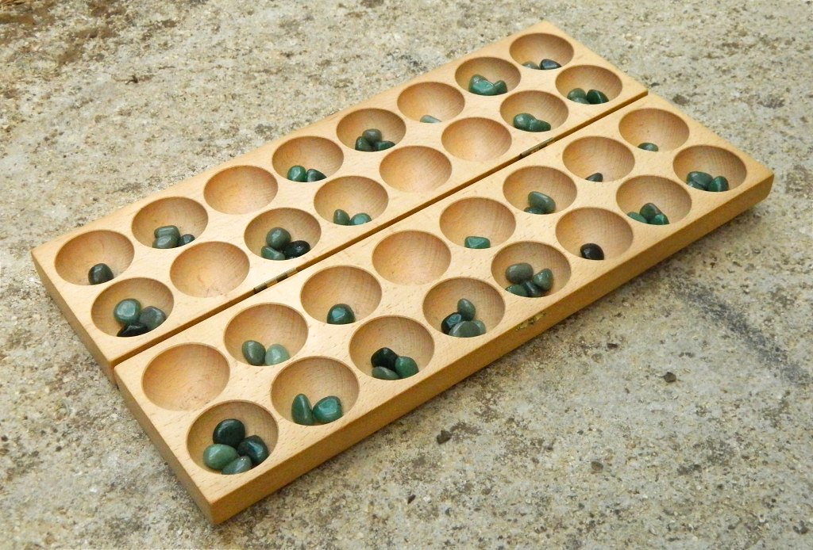

  
.. raw:: html

    <section class="first-page">
        <h1>Playing Awale with MCTS</h1>
        <h2>Master thesis submitted in partial fulfilment of the requirements
        for the degree of Master of Science in Applied Sciences and Engineering:&nbsp;Computer Science
        </h2>

        2020-2021
    </section>

  
.. contents:: Table of Contents
   :depth: 3

.. sectnum::

  
============
Introduction
============

Awale is a popular board game played mainly in Africa. The board has two rows of six pits, each containing four seeds in the initial state.

At each turn, the players move some seeds and can potentially capture some of them, according to deterministic rules. The goal of the game is to capture more seeds than one's opponent.

.. _board:

.. figure:: /_static/initial.jpg

   A typical Awalé board in the initial state with both players on their side of the board.
   

.. todo:: Explain here what i'm going to do in my thesis, why it is interesting and why it is new.

In Section 2, we present Awale in detail. We then introduce Game Theory frameworks in Section 3.
Section 4 reviews various approaches to solve Awale: retrograde analysis, :math:`\alpha\beta`-pruning Minimax, and basic Monte Carlo Tree Search.
In Section 5, we describe more advanced versions of MCTS and in particular UCT.
Section 6 presents some empirical results (simulations) allowing to compare several MCTS algorithms and Section 7 concludes.

  
=====
Awale
=====

The subject of our study, Awale is an ancient, two player board game originating from Ghana.
This game is also sometimes called Awele, Oware, Owari or Ayo in the neighboring countries, languages and cultures :cite:`crane1982`.

Originally, the game is played on the ground, by digging two rows of six small pits, each containing
stones, seeds or shells. In the present document, we will name them seeds. The game is also often played on a wooden board symbolizing the original dirt pits.
The board can be schematized as in :numref:`Figure %s <fig:initial_board>`, every big circle representing a pit and every small disc representing a seed.
Numbers at the bottom right of each pit are the counts of seeds in each pit for better readability.
Each row of pits is owned by a player that sits in front of it (:numref:`see Figure %s <board>`).
For the sake of convenience, the players are named North and South.
The 6 pits from the top row belong to North and the 6 from the bottom to South.

The players take turns, a player removing all the seeds from a pit and placing them in other pits following the rules. This is called sowing the seeds. This can result in a configuration in which the player is allowed to capture some seeds according to the rules.
The goal for each player is to capture more seeds than his opponent.
The rules vary slightly across countries and will be detailed in Section (:ref:`sec:rules`). 

  

    

    
.. _fig:initial_board:
    

.. figure:: index_files/index_6_0.svg

  
  A schematized view of the initial state of the board.

  
Mancala
-------

The Mancala games are an ancient family of game that are played on many continents :cite:`deVoogt2008`, Awale being one of them.
The word mancala comes from the Arabic word "نقلة", transliterated as "naqala" and literally meaning "to move".

Like Awale, Mancala games can consist of rows of pits, some of them having more than two rows (:numref:`see Figure %s <bao>`) and sometimes extra pits with a special role. Mancala games can sometimes be played by more than two players.
 
.. _bao:

  A wooden Bao game [#source_bao]_

There are too many variants of the Mancala games to list them all here, but a
few notable ones are Awale, Wari, Bao, Congkak and Kalah.

Mancala games in general, while less known than Chess or Go, are quite popular and
are played in tournaments around the world, both in offline and online competitions :cite:`owaresociety,fandom_tournaments`.

In particular, Kalah is a commercial, modern variant of Mancala, introduced in the 1950s by William Julius Champion Jr., that is widespread in the United States. :cite:`irving2000solving`. This variant has been studied in Artifical Intelligence as early as 1964 by :cite:`russel1964`.
Nowadays, Kalah is often used as an example game in computer-science courses.
Other Mancala games have been studied in Computer Science and Artificial Intelligence :cite:`deVoogt2008`. Tournaments opposing computers on both sides have been organised multiple times, notably in the Computer Olympiad organized by the International Computer Games Association :cite:`icga_olympiad`.

  
.. _sec:rules:

Rules of the game
-----------------

The basic rules of Awale are the same everywhere but there are some minor differences around the globe and in the literature.
The rules presented here and implemented later in this thesis are inspired from :cite:`goot2001` and adapted by us.

The goal for each player is to capture more seeds than his opponent. Because the
game has 48 seeds, capturing 25 is enough for a player to win and ends the game.

Each player plays alternatively, without the right to pass his turn. A
player's turn consists in choosing one of his non-empty pits, picking all seeds
contained in the pit and sowing them one by one in every consecutive pits on the right
(rotating counter-clockwise). The player thus has at most 6 possible moves at
each turn (one per non-empty pit owned by him).

Usually, the player that starts the game is the oldest player. In this work, South will always play first.

In this work, the pits of a player are numbered left to right from his point of view as shown in :numref:`Figure %s <fig:pit_numbering>`, :math:`1` being the leftmost pit of South, until :math:`6` at the far right. The same holds for North: :math:`1'` to :math:`6'`.

  

    

    
.. _fig:pit_numbering:
    

.. figure:: index_files/index_10_0.svg

  
  Pit numbering convention: the pits of a player are numbered left to right from his point of view.

  

As an example, in the initial state (:numref:`See Figure %s <fig:initial_board>`), the first player to move is South (on the bottom) and he plays :math:`4` (highlighted in the figure in red), the board will then be in the  state shown in :numref:`Figure %s <fig:first_move>`.

  

    

    
.. _fig:first_move:
    

.. figure:: index_files/index_13_0.svg

  
  The board after the forst move, where South played pit 4.

  
When the last sowed seed is placed in a pit owned by the opponent and, after sowing,
the pit contains two or three seeds, the content of the pit is captured by
the player and removed from the game. If the pit preceding the captured pit also
contains two or three seeds, it is also captured. The capture continues until a
pit without two or three seeds is encountered. When the capture is ended the
next player's turn starts.

Otherwise, when the last sowed seed is placed in a pit that, after sowing, contains one seed, more
than 3 seeds or in the current player's own pits, the turn of the player is ended without
any capture.
For example, if South plays :math:`4` in the configuration shown in :numref:`Figure %s <fig:pre_capture>`, he will
be able to capture the seeds in pits 2' and 3' (highlighted in red in :numref:`Figure %s <fig:post_capture>`).

  

    

    
.. _fig:pre_capture:
    

.. figure:: index_files/index_16_0.svg

  
  An example of a board configuration where South is to play pit 4.

  

    

    
.. _fig:post_capture:
    

.. figure:: index_files/index_18_0.svg

  
  The resulting board after South played 4 in :numref:`Fig %s <fig:pre_capture>`. Pits 2' and 3' will be captured.

  
If the pit chosen by the player contains more than 12 seeds, the sowing makes
more than a full revolution of the board and the starting hole is skipped during the second
and subsequent passes.

If the current player's opponent has no seed left in his half board, the
current player has to play a move that gives him seeds if such a move exists.
This rule is called the "feed your opponent".
In :numref:`Figure %s <fig:feed>`, South has to play pit 5 because playing pit 1 would leave the opponent without any move to play.

  

    

    
.. _fig:feed:
    

.. figure:: index_files/index_21_0.svg

  
  South is forced to play pit 5 because playing pit 1 would leave North without any seed to play.

  
When a player has captured more than 25 seeds the game ends and he wins. If both
players have captured 24 seeds, the game ends by a draw. If the current player's
pits are all empty, the game ends and the player with the most captures wins.

The last way to stop the game is when a position is encountered twice in the
same game (there is a cycle): the game ends and the player with most captures
wins.

  
Implementation of the rules
---------------------------

You might be reading this document in the form of a web page or a pdf file but its original form is a Jupyter Notebook :cite:`jupyter`. Jupyter Notebooks are documents mixing computer code (in this case Python code), the result of the execution of the code and text. These can be used to document experiments in the same place they are run.

Sections containing code are prefixed by :code:`In[]:` and the output of the code is showed immediately under it, prefixed by :code:`Out[]:`. An example is shown below.

  

  .. code:: ipython3

    # This is Python code
    print("This was executed by Python")

.. parsed-literal::

    This was executed by Python

  
In this subsection, we use the use the power of Jupyter Notebooks to define in multiple steps a Python :code:`Game()` class holding the state of the game and its rules. We will then successively inherit from it to add the rules and some convenience methods.

We set the following encoding conventions:
 - :code:`0` is South, :code:`1` is North,
 - player's actions are numbered from :code:`0` to :code:`5`, :code:`0` being the leftmost pit in front of him, :code:`5` being the rightmost.

First, we define a dataclass with the minimal attributes needed to store a state of the game.

  

  .. code:: ipython3

    from dataclasses import dataclass, field
    
    
    @dataclass
    class Game:
        # a 2x6 matrix containing the number of seeds in each pits
        pits: np.array = field(default_factory=lambda: np.ones(6 * 2, dtype=int) * 4)
        # 0 for South and 1 for North
        current_player: int = 0
        # the number of seeds captured by each player
        captures: np.array = field(default_factory=lambda: np.zeros(2, dtype=int))

  
Next, we add some convenient methods that will be useful later.

  

  .. code:: ipython3

    class Game(Game):
        ...
    
        @property
        def view_from_current_player(self) -> List[int]:
            """Returns the board as seen by a player"""
            if self.current_player == 0:
                return self.pits
            else:
                return np.roll(self.pits, 6)
    
        @property
        def current_player_pits(self) -> List[int]:
            """Returns a 6-vector containing the pits owned by the current player"""
            if self.current_player == 0:
                return self.pits[:6]
            else:
                return self.pits[6:]
    
        @property
        def current_opponent(self) -> int:
            return (self.current_player + 1) % 2
    
        @property
        def adverse_pits_idx(self) -> List[int]:
            """Returns the indices in the `self.pits` array owned by the opposing player"""
            if self.current_player == 1:
                return list(range(6))
            else:
                return list(range(6, 6 * 2))

  
Now that the base is set, we start implementing the rules,
some of them being deliberately excluded from this implementation:

-  Loops in the game state are not checked (this considerably speeds up the computations and we did not encounter a loop in our preliminary work);
-  The "feed your opponent" rule is removed; This makes the
   rules simpler and we expect it does not tremendously change the complexity of the game.

.. todo We did later encounter loops after running way more simulations. But this only happened yet using basic algorithms (greedy vs greedy for example). For now, we simulate 500 turns, if we hit this threshold, we declare a tie. This should be detailed in the experimental setup

  

  .. code:: ipython3

    class Game(Game):
        ...
    
        @property
        def legal_actions(self) -> List[int]:
            """Returns a list of indices for each legal action for the current player"""
            our_pits = self.current_player_pits
            # Return every pit of the player that contains some seeds
            return [x for x in range(6) if our_pits[x] != 0]
    
        @property
        def game_finished(self) -> bool:
            # Does the current player has an available move ?
            no_moves_left = np.sum(self.current_player_pits) == 0
    
            # Has one player captured more than half the total seeds ?
            HALF_SEEDS = 24  # (there are 2*6*4=48 seeds in total)
            enough_captures = self.captures[0] > HALF_SEEDS or self.captures[1] > HALF_SEEDS
    
            # Is it a draw ? Does both player have 24 seeds ?
            draw = self.captures[0] == HALF_SEEDS and self.captures[1] == HALF_SEEDS
    
            # If one of the above three are True, the game is finished
            return no_moves_left or enough_captures or draw
    
        @property
        def winner(self) -> Optional[int]:
            """Returns the winner of the game or None if the game is not finished or in a draw"""
            if not self.game_finished:
                return None
            # The game is finished but both player have the same number of seeds: it's a draw
            elif self.captures[0] == self.captures[1]:
                return None
            # Else, there is a winner: the player with the most seeds
            else:
                return 0 if self.captures[0] > self.captures[1] else 1

  
We can now define the :code:`Game.step(i)` method that is called for every step of the game.
It takes a single parameter, :code:`i`, and plays the i-th pit in the current sate.
This method returns the new state, the number of seeds captured and a boolean informing whether the game is finished.

  

  .. code:: ipython3

    class Game(Game):
        ...
    
        def step(self, action: int) -> Tuple[Game, int, bool]:
            """Plays the action given as parameter and returns:
                - a the new state as a new Game object,
                - the number of captured stones in the transition
                - a bool indicating if the new state is the end of the game
            """
            assert 0 <= action < 6, "Illegal action"
    
            # Translate the action index to a pit index
            target_pit = action if self.current_player == 0 else action - 6
    
            seeds = self.pits[target_pit]
            assert seeds != 0, "Illegal action: pit % is empty" % target_pit
    
            # Copy the attributes of `Game` so that the original
            # stays immutable
            pits = np.copy(self.pits)
            captures = np.copy(self.captures)
    
            # Empty the pit targeted by the player
            pits[target_pit] = 0
    
            # Fill the next pits while there are still seeds
            pit_to_sow = target_pit
            while seeds > 0:
                pit_to_sow = (pit_to_sow + 1) % (6 * 2)
                # Do not fill the target pit ever
                if pit_to_sow != target_pit:
                    pits[pit_to_sow] += 1
                    seeds -= 1
    
            # Count the captures of the play
            round_captures = 0
    
            # If the last seed was in a adverse pit we can try to collect seeds
            if pit_to_sow in self.adverse_pits_idx:
                # If the pit contains 2 or 3 seeds, we capture them
                while pits[pit_to_sow] in (2, 3):
                    captures[self.current_player] += pits[pit_to_sow]
                    round_captures += pits[pit_to_sow]
                    pits[pit_to_sow] = 0
    
                    # Select backwards the next pit to check
                    pit_to_sow = (pit_to_sow - 1) % 12
    
            # Change the current player
            current_player = (self.current_player + 1) % 2
    
            # Create the new `Game` instance
            new_game = type(self)(pits, current_player, captures)
    
            return new_game, round_captures, new_game.game_finished

  
As the game rules are now implemented, we can add some methods to display the current state of the board to the user, either in textual mode or as an SVG file that can be displayed inline in this document.

  

  .. code:: ipython3

    class Game(Game):
        ...
    
        def show_state(self):
            """Print a textual representation of the game to the standard output"""
            if self.game_finished:
                print("Game finished")
            print(
                "Current player: {} - Score: {}/{}\n{}".format(
                    self.current_player,
                    self.captures[self.current_player],
                    self.captures[(self.current_player + 1) % 2],
                    "-" * 6 * 3,
                )
            )
    
            pits = []
            for seeds in self.view_from_current_player:
                pits.append("{:3}".format(seeds))
    
            print("".join(reversed(pits[6:])))
            print("".join(pits[:6]))
    
        def _repr_svg_(self):
            """Return a SVG file representing the current state to be displayed in a notebook"""
            board = np.array([list(reversed(self.pits[6:])), self.pits[:6]])
            return board_to_svg(board, True) 

  
To show a minimal example of the implementation, we can now play a move and have its results displayed here.

  

  .. code:: ipython3

    g = Game()  # Create a new game
    g, captures, done = g.step(4)  # play the 5th pit (our implementation starts at 0)
    g  # Display the resulting board inline

.. figure:: index_files/index_38_0.svg

  
=====================
Awale and Game Theory
=====================

.. warning::
  Previouosly, this section contained text about perfect information games, strongly solved games, then represented perfect information games as finite state machines and trees. After reading more litterature, i decided to remove an rewrite it.
  I plan to rewrite it with the following: Set the basics of Game Theory and the concept of a "solution" to a game, talk about the minimax, define perfect information/combinatorial games then their tree representation.

  

A combinatorial game like Awale can be represented as a tree in a straightforward way where every node is a state of the game.
The root of the tree represents the initial state.
If in a state :math:`s` the current player plays action :math:`i` resulting in state :math:`s'` then :math:`s'` will be the i-th child of the node representing :math:`s`.

This results in the following properties:
    - As the current player at the root node is South and that players alternate after each turn,
      the tree contains alternating layers of current players:
      the current player for nodes with an even depth is South and for odd depths is North;
    - The leaf nodes of the tree correspond to final states;
    - The path from the root to a leaf thus represents an instance of a full game.

.. todo:: Insert a figure of an tree here

We can now define the branching factor: the maximum number of children of a node in the game.
In Awale the player can choose to sow his seeds from one of his non-empty pits.
As the player has 6 pits, the branching factor is 6.

We now implement this tree representation in Python by inheriting from :code:`Game()` class previously defined so that a state can hold references to its parent and children.

  

  .. code:: ipython3

    from __future__ import annotations
    from typing import Optional, List
    from weakref import ref, ReferenceType
    
    
    @dataclass
    class TreeGame(Game):
        # Hold an optional reference to the parent state
        parent: Optional[ReferenceType[Game]] = None
        # Hold a list of 6 optional references to the children
        children: List[Optional[Game]] = field(default_factory=lambda: [None] * 6)
        depth: int = 0

  
Next, we overload the ``Game.step(i)`` method so that we do not compute twice state if it was already in the tree. If a new node was generated, we keep a reference to the parent when we create a new child.

  

  .. code:: ipython3

    class TreeGame(TreeGame):
        ...
    
        def step(self, action):
            # If we already did compute the children node, just return it
            if self.children[action] is not None:
                new_game = self.children[action]
                captures = (
                    new_game.captures[self.current_player]
                    - self.captures[self.current_player]
                )
                return new_game, captures, new_game.game_finished
            # If not, call the original `step()` method and keep references in both directions
            else:
                new_game, captures, finished = super().step(action)
                new_game.parent = ref(self)
                new_game.depth = self.depth + 1
                self.children[action] = new_game
                return new_game, captures, finished

  

  .. code:: ipython3

    class TreeGame(TreeGame):
        ...
    
        @property
        def successors(self):
            children = [x for x in self.children if x is not None]
            successors = children + list(itertools.chain(*[x.successors for x in children]))
            return successors
    
        @property
        def unvisited_actions(self):
            return [i for i, x in enumerate(self.children) if x is None]
    
        @property
        def legal_unvisited_actions(self):
            return list(set(self.unvisited_actions).intersection(set(self.legal_actions)))
    
        @property
        def expanded_children(self):
            return [x for x in self.children if x is not None]
    
        @property
        def is_fully_expanded(self):
            legal_actions = set(self.legal_actions)
            unvisited_actions = set(self.unvisited_actions)
            return len(legal_actions.intersection(unvisited_actions)) == 0
    
        @property
        def is_leaf_game(self):
            return self.children == [None] * 6

  
================================================
Artificial Intelligence approaches to play Awale
================================================

Many algorithms have been proposed and studied to play sequential perfect information games.
A few examples detailed here are retrograde analysis, heuristic :math:`\alpha\beta` pruning Minimax,
Monte Carlo tree search (MCTS) and the most recent approach from Deepmind: Alpha Zero :cite:`AlphaGoZero`.

We will quickly present and implement those and then focus on MCTS and its variants as they are computationally feasible and do not require expert knowledge about the given game to make reasonable decisions.
Before prensenting those, we describe a :code:`Player` class that every implementation will then reuse and implement two basic agents to be used as a baseline in our comparisons.

  
The :code:`Player` class keeps track of the game state internaly.
At each turn of the game, the :code:`Player` is called with the method :code:`play()` to inform it of the action played by their opponent
(and thus update their internal state) and then chooses an action with :code:`get_action()`,
updates once more their internal state and then outputs their action for the opposing :code:`Player` to use.

  

  .. code:: ipython3

    class Player:
        def play(self, their_action):
            # If we are the first player, there is no previous action
            if their_action != -1:
                # Play the opponent's move
                self.root, _, _ = self.root.step(their_action)
            else:
                assert self.player_id == 0, "Only the first player can have their_action=-1"
            
            action = self.get_action()
            self.root, _, _ = self.root.step(action)
            
            return action

  
Naive agents
------------

In addition algorithms listed above, we also implement two most basic agents: a random and a greedy player.
While not having any interest per se due to their simplicity and low strength, these wille serve us later as a baseline to compare their strength to some more advanced algorithms.

The first agent is the most simple we can think of and does not use any intelligence at all: it lists all the legal actions it can take and chooses one uniformly at random.

  

  .. code:: ipython3

    class RandomPlayer(Player):
        def __init__(self, player_id):
            self.root = Game()
            self.player_id = player_id
        
        def get_action(self):
            return random.choice(self.root.legal_actions)

  
The second is :math:`\varepsilon`-Greedy: an agent that tries to maximise an immediate reward at each turn: the number of seeds captured during that turn.
The :math:`\varepsilon \in [0, 1]` parameter introduces randomness: at each turn, the agent draws an number :math:`e` in the uniform distribution :math:`\mathcal{U}(0, 1)`, if :math:`e > \varepsilon`, the agent chooses an action uniformly at random, else it maximises the reward.

  

  .. code:: ipython3

    class GreedyPlayer(Player):
        def __init__(self, player_id, eps=0):
            self.root = Game()
            self.player_id = player_id
            self.eps = eps
        
        def get_action(self):
            # Choose a move
            children = []
            
            for legal_action in self.root.legal_actions:
                new_state, captures, finished = self.root.step(legal_action)
                if new_state.winner is None:
                    win = 0
                elif new_state.winner == self.player_id:
                    win = 1
                else:
                    win = -1
                children.append((legal_action, captures, win))
            
            # order wins first, then by captures, then random
            sorted_children = sorted(children, key=lambda a_c_w: (-a_c_w[2], -a_c_w[1], random.random()))
            if random.random() < self.eps:
                action = random.choice(self.root.legal_actions)
            else:
                action = sorted_children[0][0]
                
            return action

  
Heuristic Minimax
-----------------

The minimax method presented before and used to find the value of a game state needs to generate the whole game tree, all the way down to the terminal states.
In Awalé and other complex games, as shown before, generating the whole tree is computationaly very hard and not practical. :cite:`Shannon1988` proposed an adaptation of the minimax where instead of generating the whole tree, it is generated up to the depth :math:`d`. Nodes at depth :math:`d` are then considered as leafs and their value are estimated using an heuristic instead of being computed by looking at the values of their children. 

The heuristic used should try to estimate the value of the node only by inspecting the state of the game and can be of varying complexity. A simple approach as taken here is to count the difference of the number of seeds each player has captured. As heuristics are most often crafted by hand using human knowledge of the game, exploring more complex ones are beyond the scope of this work.

The complexity of the heuristic minimax algorithm is :math:`O(b^d)` where :math:`b` is the average branching factor. A well known optimisation of this algorithm called alpha-beta pruning minimax (:math:`\alpha\beta` minimax) returns the same result and has an average performance of :math:`O(\sqrt{b^d})`. 

The algorithm keeps track of two values, :math:`\alpha` and :math:`\beta`, which hold the minimum score that the maximizing player is assured of and the maximum score that the minimizing player is assured of.
Initially, :math:`\alpha = -\infty` and :math:`\beta = +\infty`: both players begin with their worst possible score.
If the maximum score that the minimizing player is assured of becomes less than the minimum score that the maximizing player is assured of (so :math:`\beta < \alpha`), the maximizing player does not need to consider further children of this node (it prunes the node), as they are certain that the minimizer player would never play this move.
This pruning of entires sub-trees is where the complexity gain comes from. 
As :math:`\alpha\beta` minimax has no disadvantage over minimax, this is the one we implement.

  

  .. code:: ipython3

    class AlphaBetaMinimaxPlayer(Player):
        def __init__(self, player_id, cutoff_depth):
            self.root = Game()
            self.player_id = player_id
            self.cutoff_depth = cutoff_depth
        
        def get_action(self):
            actions = self.root.legal_actions
            values = []
            for action in actions:
                child, _, _ = self.root.step(action)
                value = self.minimax(child, self.cutoff_depth, float("-inf"), float("+inf"), False)
                values.append(value)
            best_action, best_value = max_rand(list(zip(actions, values)), key=lambda x: x[1])
            
            return best_action
            
            
        def minimax(self, node, depth, alpha, beta, is_maximizing):
            if depth == 0 or node.game_finished:
                return self.evaluate(node)
            
            if is_maximizing:
                value = float("-inf")
                for action in node.legal_actions:
                    child, _, _ = node.step(action)
                    value = max(value, self.minimax(child, depth - 1, alpha, beta, False))
                    alpha = max(alpha, value)
                    if alpha >= beta:
                        break
                return value
            else:
                value = float("+inf")
                for action in node.legal_actions:
                    child, _, _ = node.step(action)
                    value = min(value, self.minimax(child, depth - 1, alpha, beta, True))
                    beta = min(beta, value)
                    if alpha >= beta:
                        break
                return value
            
        def evaluate(self, node):
            return node.captures[self.player_id] - node.captures[1 - self.player_id]

  
Retrograde analysis
-------------------

Board games can mostly be divided into two separate categories. The first category consist
of games where the number pieces on the board increases over time, because players add pieces on the board during their turn. The state space increases over time: these are called divergent games.
Examples of these games are Tick Tack Toe, Connect Four and Go.
The second category consists of games where the number of pieces on the board decreases over time because players may capture pieces over time. Those are called convergent games.
Games that belong to this category are Chess, Checkers, Backgammon and Awalé :cite:`vandenherik2002`.

For both divergent and convergent games, search algorithms can prove the game result for positions near
the end of a game. However, for divergent games the number of endgame
positions is so big that enumerating all of them is computationally impossible (except for trivial
games like Tic-Tac-Toe). However, for convergent games, the number of positions
near the end of the game is small. Usually small enough to traverse them all, and collect
their game values in a database, a so called endgame database.

Retrograde Analysis computes endgame databases by going backward from values of final
positions towards the initial position :cite:`goot2001`.
First, Retrograde Analysis identifies all final positions in which the game value is known.
By making reverse moves from these final positions the game value of some non-final positions can be deduced. And by making reverse moves from these newly proven non-final positions, the game value of other non-final positions can be deduced. This can continue either by running of available memory or by having enumerated all the legal positions in the game.

Ströhlein is the first researcher who came up with the idea to create endgame databases and applied his idea to chess :cite:`endgame1970`.
The first endgame database for Awale has been created by :cite:`allis1995` and was followed by many others, while the quest was ended by :cite:`romein2003solving` publishing a database for all legal positions.

The above-mentioned results for Kalah and Awale both use an almost brute-force
method to solve the game and use a database of all possible states. The database
used by :cite:`romein2003solving` has 204 billion entries and weighs 178GiB.
Such a huge database is of course not practical and we thus think there is still room for
improvement if we can create an agent with a policy that does not need a
exhaustive database, even if the agent is not capable of a perfect play.

Monte Carlo Tree Search
-----------------------

Algorithm
~~~~~~~~~

.. figure:: _static/mcts-algorithm.png

   The 4 steps of MCTS :cite:`chaslot2008monte`

The (partial) tree is constructed as follows:

* Selection: starting at the root node, recursively choose a child until
  a leaf :math:`L` is reached
* Expansion: if :math:`L` is not a terminal node\footnote{As the tree is
  not complete, a leaf could be a node that is missing its children, not
  necessarily a terminal state}, create a child :math:`C`
* Simulation: run a playout from :math:`C` until a terminal node :math:`T` is
  reached (play a full game)
* Back-propagation: update the counters described below of each ancestor
  of :math:`T`.

Each node holds 3 counters : (:math:`W_S`), the number of simulations using this node ended that
with a win for South;  and North (:math:`W_N`). From this
counters, a probability of North winning conditional on a given action can be computed
immediately: :math:`\frac{W_N}{N}`.

This sampling can be ran as many times as allowed (most of the
time, the agent is time constrained). One can also stop the sampling earlier if

each time refining the probability of
winning when choosing a child of the root node. When we are done sampling, the
agent chooses the child with the highest probability of winning and plays the
corresponding action in the game.

the total number of times a node has been played during a
sampling iteration (:math:`N`)

XXX Every game are played at full random so the value of a node (wins - losses / total_games) will converge to the mean of all possible children games. A lot of early implementations of MCTS were trying to be clever by pruning some branches or choose more often promising moves. We intentionaly choose at full random so we can compare it later to UCT that chooses in a formalized way with no domain knowledge and is proven to converge to minimax.

  
Implementation
~~~~~~~~~~~~~~

  

  .. code:: ipython3

    @dataclass
    class TreeStatsGame(TreeGame):
        wins: np.array = field(default_factory=lambda: np.zeros(2, dtype=int))
        n_playouts: int = 0
    
        def update_stats(self, winner):
            if winner in [0, 1]:
                self.wins[winner] += 1
            self.n_playouts += 1
            if self.parent and self.parent():
                self.parent().update_stats(winner)

  
The MCTS first chooses a node to expand with the `tree_policy()` when the node is found, it is expanded with the `default_policy()`. When reaching a terminal node, the counters are updated. This is repeated `BUDGET` times and then the final action is chosen as the action that has the highest mean of game values (game value is 1 for wins, 0 for draws, -1 for losses).

Both policies in this implementation are random walks.

  

  .. code:: ipython3

    class MCTSPlayer(Player):
        def __init__(self, player_id, budget: timedelta):
            self.root = TreeStatsGame()
            self.player_id = player_id
            self.budget = budget
    
        def tree_policy(self, node):
            while not node.is_leaf_game:
                if node.is_fully_expanded:
                    node = random.choice(node.expanded_children)
                else:
                    action = random.choice(node.legal_unvisited_actions)
                    node, _, _ = node.step(action)
            return node
        
        def explore_tree(self):
            # Choose a starting node
            node = self.tree_policy(self.root)
    
            # Run a simulation on that node
            finished = node.game_finished
            while not finished:
                action = self.default_policy(node)
                node, _, finished = node.step(action)
    
            # Backtrack stats
            node.update_stats(node.winner)
        
        def default_policy(self, node):
            # Random walk
            return random.choice(node.legal_actions)
        
        def action_score(self, x):
            node = self.root.children[x]
            if node is None:
                return float("-inf")
    
            return (node.wins[self.player_id] - node.wins[1 - self.player_id]) / node.n_playouts
        
        def final_selection(self):
            return = max(self.root.legal_actions, key=self.action_score)
            
        
        def get_action(self):
            start = datetime.now()
            end = start + self.budget
            while datetime.now() < end:
                self.explore_tree()
            
            return self.final_selection()

  
================================
Monte Carlo tree search variants
================================

  
Upper Confidence Bounds for Trees
---------------------------------

Because basic MCTS samples uniformly the game tree, it spends compute time estimating the value of uninsteresting nodes that will never be played in a real game. A more efficient method would instead explore more often the interesting parts of the tree: an asymmetric method.
:cite:`kocsis2006bandit` defined Upper Confidence Bounds for Trees (UCT), a method combining during the selection process vanilla MCTS and Upper Confidence Bounds (UCB) used in the multi-armed bandit problem.

Basic MCTS, during the tree policy, chooses a child at random even if the children is likely of having a poor mean value. UCT instead treats the choice of child as a multi-armed bandit problem: picking a child for which we have an estimation of the true value to make a simulation is analogous to picking a slot machine for which we have an estimation of the true reward probability. 

XXX When a node has not been visited much, the ratio of wins to visits is an estimation of the mean value of the children. But after a time, UCT prioritizes more the good moves so the value drifts and converges to the game theoretic value (:cite:`kocsis2006bandit`). This means that the bandit is non stationary but this is ok as it does not drift too much.

UCT adapts UCB to a game tree and gives us the following formula for the upper confidence bound:

.. math::

    \frac{W_1}{N} + c \times \sqrt{\frac{ln N'}{N}},

where :math:`N'` is the number of times the
parent node has been visited and :math:`c` is a parameter that can be tuned to balance exploitation of known wins and exploration of
less visited nodes.

The tree policy from MCTS is then replaced by a policy always chosing the node with the highest upper confidence bound, resolving ties by a coin toss.
:code:`UCTPlayer` thus reuses the MCTS agent but subclasses the :code:`tree_policy`.

  

  .. code:: ipython3

    from lib.utils import max_rand
    
    class UCTPlayer(MCTSPlayer):
        def __init__(self, player_id, budget: Union[int, timedelta], c: float):
            super().__init__(player_id, budget)
            self.c = c
            
        def node_score(self, node):
            exporation = node.wins[node.current_opponent] / (node.n_playouts + 1)
            exploitation = math.sqrt(math.log(node.parent().n_playouts) / (node.n_playouts + 1))
            return exporation + self.c * exploitation
    
        def tree_policy(self, node):
            while not node.is_leaf_game:
                if node.is_fully_expanded:
                    node = max_rand(node.expanded_children, key=self.node_score)
                else:
                    action = random.choice(node.legal_unvisited_actions)
                    node, _, _ = node.step(action)
            return node

  
Informed UCT
------------

:code:`GreedyUCTPlayer` subclasses :code:`UCTPlayer` and changes the :code:`default_policy` to weigh more the actions that will give more immediate rewards.

  

  .. code:: ipython3

    class GreedyUCTPlayer(UCTPlayer):    
        def default_policy(self, node):
            # Greedy walk
            assert len(node.legal_actions) != 0
            captures = [node.step(action)[1] + 1 for action in node.legal_actions]
            return random.choices(node.legal_actions, weights=captures)[0]

  
Alpha Zero
----------

To replace the random play in the simulation step, :cite:`AlphaGoZero` proposes
to use a neural network to estimate the value of a
game state without having to play it. This can greatly enhance the performance
of the algorithm because much less playouts are required.

  
=================
Empirical results
=================

This section first describes the statistical framework used to compare two agents and the method used to compare and rank multiple agents. Next, we detail the experimental setup in wich the games between agents are played as well as the method used to run the experiments in a massively parallel setup to be able to record enough game to have statistically strong results. We then run our experiments, analyze their results and present a ranking between our agents.

  
Comparing algorithms
--------------------

How to compare A and B
~~~~~~~~~~~~~~~~~~~~~~

Because the outcome of a match between two agents is not deterministic, we can not rely on a single match to ascertain than the winner of a match is better than the looser. So the first step is to define a statistical method to compare two arbitrarily chosen agents: A and B.

The probability that A wins is denoted by :math:`p` and is unknown (the probability that B wins is :math:`1-p`).
Our null hypothesis is that both agents are equaly strong (:math:`p=0.50`) and the alternative hypothesis is that they are of different strength (:math:`p \neq 0.50`).
To compare agents A and B, we run :math:`N` matches and A wins :math:`n` times (thus B wins :math:`N-n` times).

Using the SciPy function :code:`scipy.stats.binom_test`, we then compute the p-value.
If it is lower than :math:`5\%`, we traditionally reject the null hypothesis.
This guarantees that, conditional on H0 being true, the probability of making an incorrect decision is :math:`5\%`.
But if H1 is true, the probability of an incorrect decision is not necessarily :math:`5\%`: it depends on the number :math:`N` of matches and on the true value of :math:`p`.
To ensure that the probability of an incorrect decision, conditional on H1, be acceptable, we resort to the concept of statistical power.

Suppose the true probability :math:`p` is :math:`0.75`. This is very far from the null hypothesis. In that case, we want the probability of choosing H1 (not making an incorrect decision) to be high (for instance :math:`95\%`). This probability is the power and can be computed by means of the R function :code:`powerBinom` implemented in the R package :code:`exactci`. The output of this function is the number :math:`N` of matches needed to achieve the desired power and it is 49. As we always play a even number of matches between two agents (A vs. B and B vs. A), we decide that we need :math:`N=50` matches.

Now that we know the number of matches we need to play to be able to assertain that H1 is probable enough, we still need to know how many matches of the 50 an agent needs to win so we may declare H1 true. This can be done with the :code:`scipy.stats.binom_test` function.

  

  .. code:: ipython3

    for wins in range(50):
        pvalue = scipy.stats.binom_test(wins, 50, p=0.5, alternative="greater")
        if pvalue < 0.05:
            print("If a agent wins", wins, "matches, we can reject H0 with a p-value of", round(pvalue, 4))
            break

.. parsed-literal::

    If a agent wins 32 matches, we can reject H0 with a p-value of 0.0325

  
With this method, we can then define a relation "is stronger than" or "relation of strength", noted :math:`\succ` over the set of agents where :math:`A \succ B` if when playing 50 matches between A and B, A wins more than 31 matches. 

  
Transitivity of the strength relation
~~~~~~~~~~~~~~~~~~~~~~~~~~~~~~~~~~~~~

We have a method to determine if an agent is stronger than another but we don't have a way to order all our agents regarding to their strength. It could be tempting to use a sorting algorithm to order the agents using the :math:`\succ` relation but for this to be correct, the relation has to be transitive.

In the following mind experiment, we prove that the relation of strength between two agents is not transitive and thus a total order between all possible agents does not exist.

Lets define 3 theoretical algorithms: each of them play the first move at random and the next moves of the match depending on the first move in three different ways: always playing the best move (noted :math:`+`), always playing the worst move (noted :math:`-`) or playing at random (noted :math:`r`).

.. table:: Moves of the theoretical algorithms A, B and C depending on the first move of the game.

    +------------+-----------+-----------+-----------+
    | First move | A         | B         | C         |
    +------------+-----------+-----------+-----------+
    | 1, 2       | :math:`+` | :math:`r` | :math:`-` |
    +------------+-----------+-----------+-----------+
    | 3, 4       | :math:`r` | :math:`-` | :math:`+` |
    +------------+-----------+-----------+-----------+
    | 5, 6       | :math:`-` | :math:`+` | :math:`r` |
    +------------+-----------+-----------+-----------+

If A and B are playing matches, if the match starts with move:
 - 1 or 2: A wins,
 - 3 or 4: A wins more than half the matches,
 - 5 or 6: B wins.
 
So A wins more matches than B and we can say :math:`A \succ B`. By doing the same with B vs. C and C vs. A we have :math:`B \succ C` and :math:`C \succ A`. Thus the relation between these 3 theoretical algorithms is not transitive.

How to compare more than two agents
~~~~~~~~~~~~~~~~~~~~~~~~~~~~~~~~~~~

As described above, transitivity can not be proved in all cases so we can not use a sorting algorithm to order our agents. We thus have to resort to a full tournament where the relation :math:`\succ` is eveluated between every pair of agent. 

We have 6 algorithms, each with some continuous or discrete parameters. Even if we restrict every parameter to a small finite set of values (let's say 100), we would still have 600 agents to compare. This would in turn make a tournament of size :math:`600^2` where each evaluation of the relation requires 50 matches. This method would thus require :math:`600^2 * 50 = 18\,000\,000` matches. Playing such a big number of matches is hardly feasible so we will resort to a more frugal approach.

The approach that we take is to first select, for each algorithm, the parameters that result in the best agent (a champion). This will in turn reduce the number of agents playing in the tournament to 6 and the number of matches to play to :math:`6^2 * 50 = 180`, a much more reasonable number. While this approach reduces drastically the amount of computations needed, it might not be perfect.
We have no guarantee that the champion whithin a family (all agents derived from a single algorithm) is also the best family member against agents from other families. This is a known limitation and verifying this assumption is outside of the scope of this work.  

Champion selection
~~~~~~~~~~~~~~~~~~

Let  :math:`A_x` be an algorithm :math:`A` with a continuous parameter :math:`x \in X` and :math:`f_n(A_{x}, A_{y})`, the number of wins of :math:`A_{x}` against :math:`A_{y}` after :math:`n` matches.
We make the assumption that with :math:`n` big enough, :math:`f_n(A_{x}, A_{y})` is smooth for all :math:`x,y \in X` due to the fact that both agents :math:`A_{x}` and :math:`A_{y}` share the same algorithm. This smoothness property will be empirically confirmed later (see XXX and XXX).

So, for :math:`x_1` close to :math:`x_1` and :math:`y_1` close to :math:`y_2`, the value of :math:`f_n(A_{x_1}, A_{y_1})` gives us an indication about the value of :math:`f_n(A_{x_2}, A_{y_2})`.
This assumption and the fact that we evaluate :math:`f_n` over a dense sample of the parameter space allows us to compare agents from a single family by playing much less matches than the 50 matches derived from our statistical power analysis.

During the champion selection, contrary to the full tournament, we also assume that the strength relation :math:`\succ` over agents of a family is "approximately" transitive: we expect that :math:`\forall y \in X, \exists x \neq y, y \in X | f_{\infty}(A_{x}, A_{y}) > n/2`: there exists an agent that wins more than half the time against every other agent of its family.

  
Tournament solution
~~~~~~~~~~~~~~~~~~~

.. todo::
  We will use the framework of tournament solutions :cite:`laslier` to analyze the results and eventualy find a total order or an overall best agent. This will be done once we have our final results.

  

Experimental setup
------------------

A match between two agents is played with the following code, where the variables :code:`player` and :code:`opponent` contain an instance of an agent (a class derived from :code:`Player`).
Because most games finish in less than 200 moves, we limit games to 500 moves to avoid playing infinite games. A game that goes over the threshold of 500 moves is considered a draw, regardless of the score of both players.

  

  .. code:: ipython3

    game = Game()
    opponent_action = -1
    depth = 0
    
    start = time.perf_counter()
    
    while not game.game_finished and depth < 500:
        player_action = player.play(opponent_action)
        game, captures, finished = game.step(player_action)
    
        player, opponent = opponent, player
        opponent_action = player_action
        depth += 1
    
    duration = round(time.perf_counter() - start, 4)

  
Relevant data from the match can then be recorded in a dictionary like below where:
 * :code:`duration` is the total duration of the game in seconds,
 * :code:`depth` is the number of moves played by both agents,
 * :code:`score` is a tuple of score of South followed by the score of North,
 * :code:`winner` is :code:`0` if South won, :code:`1` if North won and :code:`None` is the game was a draw.

  

  .. code:: ipython3

    {
        "duration": duration,
        "depth": depth,
        "score": game.captures.tolist(),
        "winner": game.winner,
    }

.. parsed-literal::

    {'duration': 0.0089, 'depth': 57, 'score': [25, 8], 'winner': 0}

  
Because the number of matches we expect to play is quite high and a match between two agents might take a few minutes of CPU time, we have to be able to play a big number of run matches in parralel.

We used the infrastructure of Amazon Web Services (AWS) to be able to access hundreds of CPU cores at the same time and used AWS Batch to schedule the jobs across the different machines.

To this effect, we placed the code to run a match in a standalone Python script that accepts parameters to give to the agents via environment variables and packaged it in a Docker container. When a game is finished, the dictionary showed above is then outputed to the standard output.

This Docker container is then used as a template to launch AWS Batch tasks in parallel, their standard output being sent to AWS Cloudwatch to be analyzed later.
Each match was in a separate AWS Batch task was allowed 1 vCPU with 500MB of RAM. Those tasks were running on C5 compute optimized EC2 instances [#aws_c5]_. 

AWS Batch tasks can be launched with the :code:`submit_match()` function, using itself the :code:`submit_aws_job()` utility function defined in Annex XXX.

  

  .. code:: ipython3

    from lib.utils import submit_aws_job
    
    def submit_match(a, b, pool, side, timeout=600):
        return submit_aws_job(
            jobDefinition='run-match',
            jobName=pool,
            jobQueue='match-queue',
            containerOverrides={
                'command': ["python", "simulate.py"],
                'environment': [
                    {'name': 'PLAYER_A', 'value': a % 0},
                    {'name': 'PLAYER_B', 'value': b % 1},
                    {'name': 'POOL','value': pool},
                    {'name': 'SIDE', 'value': str(side)},
                ]
            },
            timeout={'attemptDurationSeconds': timeout},
        )

  
Because we can not be sure an agent has the same strength if it is allowed to be the first player as if it is the second to play, each time we play a match between two agents (A and B), we play the match A vs B and B vs A.

  

  .. code:: ipython3

    def sumbit_symmetric_match(a, b, pool, timeout=600):
        submit_match(a, b, pool, side=0, timeout=timeout)
        submit_match(b, a, pool, side=1, timeout=timeout)

  
Results of the jobs submited to AWS Batch can then be found in AWS CloudWatch. They are downloaded with a script available in the Annex XXX and then stored in :code:`source/data/*.jsonl`. These results are then processed and normalised and made available in Pandas DataFrame :cite:`pandas` importable with the following code.

  

  .. code:: ipython3

    from lib.results import results

  
Algorithm tuning
----------------

:math:`\varepsilon`-Greedy
~~~~~~~~~~~~~~~~~~~~~~~~~~

The first agent we have to tune is :math:`\varepsilon`-Greedy and it has one parameter, :math:`\varepsilon` that can very in the interval :math:`[0, 1]`. As running a match between two :math:`\varepsilon`-Greedy agents takes less than 100ms, playing thousands of matches is computaionaly feasible.

We thus pick evenly spaced values of :math:`\varepsilon` in the interval :math:`[0, 1]` and play 50 matches for each pair of values of :math:`\varepsilon`.

  

  .. code:: ipython3

    search_space = np.linspace(0, 1, 21)
    
    for i in range(25):
        for eps1 in search_space:
            for eps2 in search_space:
                player = f"GreedyPlayer(%s, {eps1})"
                opponent = f"GreedyPlayer(%s, {eps2})"
                sumbit_symmetric_match(player, opponent, "local-eps-matrix")

  
The results of these matches is shown in :numref:`Figure %s <eps-matrix>` below in wich we can see despite the noise that a higher value of :math:`\varepsilon` (meaning the agent choses most often the greedy approach) is stronger than a lower value. Due to the noise in the data despite the high number of games played it is hard to know for sure if :math:`\varepsilon = 1` is the optimium or if it is a bit lower. We will keep a value of :math:`\varepsilon = 0.95` for the rest of this work.

.. _eps-matrix:

.. figure:: /notebooks/plot-eps.png

  Heatmap of the win ratio of the row player against the column player.

  
MCTS
~~~~

The MCTS agent has a parameter :math:`t` that states how much time the agent may spend on simulation during its turn.
As :cite:`kocsis2006bandit` have shown that given enough time MCTS (XXX UTC converges, not MCTS) converges to the minimax tree and thus is optimal, we know that the higher is :math:`t`, the better the agent will be. However, since we are constrained by the capacity of our computation resources, we have to choose a reasonable value of :math:`t`.

Given our objective of producing an agent capable of playing against a human, choosing a value of :math:`t` higher than 1 minute is unrealistic as the human will not want to wait more than that at each turn of the game. While 1 minute is an upper bound, having a much smaller waiting time at each turn would be valuable. We think that  :math:`t = 5s` is a reasonable value.

As stated earlier, we know that the strength of the agent is an increasing function of :math:`t`. However, we don't know the shape of this function. We compare the strength of MCTS(t=5) against a range of values of :math:`t' \in \{0.5, 1, 1.5, 2, 3, 5, 7, 10, 15, 20, 30, 40\}` by playing 10 matches for each value of :math:`t'`.

  

  .. code:: ipython3

    search_space = [0.5, 1, 1.5, 2, 3, 5, 7, 10, 15, 20, 30, 40]
    
    for i in range(5):
        for time in search_space:
                player = "MCTSPlayer(%s, td(seconds=5))"
                opponent = f"MCTSPlayer(%s, td(seconds={time}))"
    
                sumbit_symmetric_match(player, opponent, "mcts-5s-time-compare", timeout=60*100)

  
While the results showin in :numref:`Figure %s <fig:mcts-time_5s>` are also noisy, we indeed see that the strength of MCTS increases with :math:`t` but the slope of the curve is not very important after :math:`t=5s` so we decide that :math:`t=5s` is a good compromise between strength and waiting time.

  

    

    
.. _fig:mcts-time_5s:
    

.. figure:: index_files/index_89_0.svg

  
  Strength of MCTS related to the allowed simulation time budget

  
UCT
~~~

The UCT agent has 2 variables that we can tune, :math:`t` as in MCTS and :math:`c` the balance between exploration and exploitation. We will fix :math:`t=5s` so that we can fairly compare MCTS and UTC later.
:cite:`kocsis2006bandit` has shown that :math:`c=\frac{\sqrt{2}}{2}` is a good starting value. We thus play matches of UCT(:math:`c=\frac{\sqrt{2}}{2}`) against a range of 11 values equaly spaced between 0.2 and 2.2

  

  .. code:: ipython3

    search_space = np.linspace(0, 2, 11) + 0.2
    
    for i in range(25):
        for c in search_space:
                player = "UCTPlayer(%s, td(seconds=5), c=math.sqrt(2)/2)"
                opponent = f"UCTPlayer(%s, td(seconds=5), c={c:.2f})"
    
                sumbit_symmetric_match(player, opponent, "uct-tuning-c")

  
What we see in :numref:`Figure %s <utc-tuning-c>` is a bell curve with some noise and a plateau around :math:`c = \sqrt(2) / 2`. The noise is louder on the right than on on the left of its maximum. An explanation for this could be that on the left, as :math:`c` is lower, there is not much exploration so the algorithm is more deterministic while it's the opposite on the right and each simulation could be either really good or really bad depending on luck.

As the maximum of the bell curve is around :math:`c = \sqrt(2) / 2` it seems to confirm that it is the optimum value for UCT.

.. _utc-tuning-c:

.. figure:: notebooks/uct-value.png

  Strength of UCT(:math:`c=\frac{\sqrt{2}}{2}`) against other values of :math:`c`.

  
Under the assumption that the curve is smooth, we know that :math:`c = \sqrt(2) / 2` is will win against any value of :math:`c \in [0.2, 2.2]`. While this result might be convenient, we don't know if the relation of one agent winning against another is transitive, so while :math:`c = \sqrt(2) / 2` beats every value, we might have another value of :math:`c = \sqrt(2) / 2` that beats every :math:`c \neq \sqrt(2) / 2` by a bigger margin. To have a better intuition it is the case or not, we can also run the same experiment as above but with :math:`c = 1.5` to see if we were not lucky by using :math:`c = \sqrt(2) / 2` the first time. 

  

  .. code:: ipython3

    search_space = np.linspace(0, 2, 11) + 0.2
    
    for i in range(25):
        for c in search_space:
                player = "UCTPlayer(%s, td(seconds=5), c=1.5)"
                opponent = f"UCTPlayer(%s, td(seconds=5), c={c:.2f})"
    
                sumbit_symmetric_match(player, opponent, "uct-tuning-c-15")

  
While the curve in :numref:`Figure %s <uct-tuning-c-15>` is not as smooth as in the first experiment, the result of the matches against :math:`c = 1.5` seem to show the same curve with a maximum at :math:`c = \sqrt(2) / 2`.

.. _uct-tuning-c-15:

.. figure:: notebooks/uct-c-15.png

  Strength of UCT(:math:`c=1.5`) against other values of :math:`c`.

  
Tournament results
------------------

We select the best agent for every algorithm and make each of them play 50 match against each other.

  

  .. code:: ipython3

    algos = [
        "RandomPlayer(%i)",
        "GreedyPlayer(%i, 0.95)",
        "MCTSPlayer(%i, td(seconds=5))",
        "UCTPlayer(%i, td(seconds=5), c=math.sqrt(2)/2)",
        "GreedyUCTPlayer(%i, td(seconds=5), c=math.sqrt(2)/2)",
    ]
    
    for i in range(25):
        for a in algos:
            for b in algos:
                sumbit_symmetric_match(a, b, "tournament")

  
The results, displayed in a matrix in :numref:`Figure %s <matrix>`, show that UCT and GreedyUCT beat every other agent. There is no clear winner between those 2 champions though.

.. _matrix:

.. figure:: notebooks/matrix.png

  Matrix representation of the valued tournament between every algorithm
  
.. todo:: We still have to transform the values tournament in a binary one and then analyze it with the framework of tournament solutions.

Limitations
-----------

.. todo:: As we only compare the champions of each algorithm, we might have a non-champion that would still won against another algo. Then we would not have a complete pre-order. We can not do this due to compute limitation.

  
==========
Conclusion
==========

  
========
Appendix
========

Bibliography
------------

.. bibliography:: refs.bib
   :style: custom

  
Footnotes
---------

.. [#source_bao] Picture by Yintan under Creative Commons SA license https://commons.wikimedia.org/wiki/File:Bao_europe.jpg
 
 .. [#aws_c5] C5 instances contain a 2nd generation Intel Xeon Scalable Processor (Cascade Lake) with a sustained all core Turbo frequency of 3.6GHz.

  
Appendix
--------

:doc:`removed`

